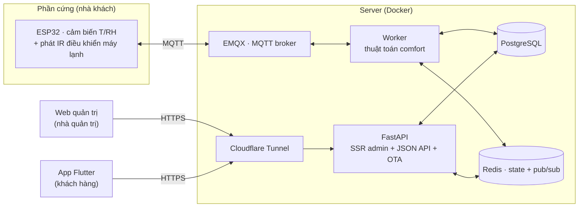

# Aircon — Hệ thống điều hoà thích ứng

Aircon là hệ thống điều khiển điều hoà **thích ứng theo khí hậu**: cảm biến ESP32 đo
nhiệt độ/độ ẩm trong và ngoài nhà, một thuật toán comfort tính ra nhiệt độ đặt tiết kiệm
điện, và người dùng điều khiển máy lạnh qua ứng dụng điện thoại. Nhà quản trị (bên bán)
quản lý khách hàng, thiết bị và phát hành bản cập nhật app qua một trang web riêng.

Dự án gồm ba phần chạy chung một backend:

- **Web quản trị** (SSR, dành cho **nhà quản trị/bên bán**) — quản lý khách hàng, cấp mã
  kích hoạt, quản lý node, tinh chỉnh thuật toán, phát hành OTA.
- **App Flutter** (dành cho **khách hàng**) — kích hoạt bằng mã, xem số đo trực tiếp,
  điều khiển điều hoà, tự cập nhật qua OTA.
- **API + Worker** (FastAPI + MQTT) — phục vụ cả web lẫn app từ **một tầng nghiệp vụ duy
  nhất**, nên số liệu trên web và trên app không bao giờ lệch nhau.

---

## Mục lục

- [Tính năng](#tính-năng)
- [Kiến trúc](#kiến-trúc)
- [Thuật toán comfort](#thuật-toán-comfort)
- [Công nghệ](#công-nghệ)
- [Cấu trúc dự án](#cấu-trúc-dự-án)
- [Chạy trên máy local](#chạy-trên-máy-local)
- [Biến môi trường](#biến-môi-trường)
- [Triển khai lên server](#triển-khai-lên-server)
- [Hướng dẫn sử dụng](#hướng-dẫn-sử-dụng)
- [Bảo mật](#bảo-mật)

---

## Tính năng

### Web quản trị (nhà quản trị)

- **Tổng quan (fleet view)** — toàn bộ node đã bán của mọi khách, gom theo khách hàng
  (xếp A→Z, gập/mở), kèm biểu đồ trạng thái trực tuyến/ngoại tuyến.
- **Khách hàng & Máy** — bán sản phẩm (tạo khách + node + mã kích hoạt), quản lý node
  (thêm/sửa/xoá), cấp thêm mã, xoá mã dư, xem số đo từng node, tìm khách theo SĐT.
- **Cấu hình thuật toán** — tinh chỉnh tham số comfort cho **từng khách**.
- **Phiên bản app** — tải APK lên, phát hành OTA, xem lịch sử, rollback.
- **Quản trị viên** — thêm/xoá tài khoản nhân viên.
- Cập nhật realtime qua WebSocket, lưu không tải lại trang (AJAX + xác nhận trong app).

### App khách hàng (Flutter)

- **Kích hoạt bằng mã** — nhập mã được cấp khi mua máy để tạo tài khoản (nhập tên, SĐT,
  email; thông tin tự hiện trên web quản trị).
- **Bảng điều khiển** — nhiệt độ đặt hiện tại + chuỗi tính toán (có thể kiểm chứng).
- **Điều khiển** — chọn chế độ, ghi đè thủ công, học mã điều khiển hồng ngoại (IR learn).
- **Số đo trực tiếp** — trong/ngoài nhà, biểu đồ lịch sử.
- **Tự cập nhật OTA** — báo có bản mới, tải và cài trực tiếp.

### Điểm nổi bật kỹ thuật

- **Một tầng nghiệp vụ, hai giao diện** — web SSR và app JSON dùng chung service, số liệu
  không trôi lệch.
- **Đa khách hàng (multi-tenant)** — mọi truy vấn khoá theo tổ chức; nhà quản trị là vai
  trò duy nhất nhìn xuyên khách hàng (cờ `is_sysadmin`).
- **OTA cho app** — APK lưu trên volume Docker, sống sót qua mỗi lần deploy.
- **Kích hoạt bằng mã một lần** — chống tương tranh bằng khoá hàng (`SELECT ... FOR
  UPDATE`), một mã chỉ tạo được một tài khoản.

---

## Kiến trúc



**Luồng dữ liệu:** ESP32 đẩy số đo qua MQTT → worker cập nhật trạng thái (Redis) + lịch sử
(Postgres) và tính nhiệt độ đặt → phát lệnh IR về ESP32. API phục vụ web + app; Redis
pub/sub đẩy cập nhật realtime tới WebSocket. Cloudflare Tunnel là đường duy nhất từ
internet vào — không cổng nào mở ra `0.0.0.0`.

---

## Thuật toán comfort

Nhiệt độ đặt được tính theo mô hình **adaptive comfort** (de Dear & Brager, ASHRAE
RP-884), không phải một con số cố định:

1. **Trung bình trượt ngoài trời** (`T_rm`) — làm mượt nhiệt độ ngoài trời bằng EMA
   (trọng số `ema_alpha`), tránh nhảy theo từng biến động tức thời.
2. **Điểm trung tính** — `T_neutral = 0.31 · T_rm + 17.8` (hợp lệ khi `10 ≤ T_rm ≤ 33.5`).
3. **Bù trừ độ ẩm** — dưới 60%RH không phạt; 60–75% trừ dần theo `humid_slope`; trên 75%
   phạt nặng hơn (bay hơi mồ hôi kém hiệu quả).
4. **Lịch đêm** — cộng thêm `night_offset` trong khung giờ `night_start`→`night_end`.
5. **Giới hạn an toàn** — kẹp kết quả trong `[clamp_min, clamp_max]`.

Các tham số ở bước 1, 3, 4, 5 **tinh chỉnh được cho từng khách** trong trang *Cấu hình
thuật toán*. Hằng số hồi quy (0.31 / 17.8) là khoa học cố định, không chỉnh.

Chống dao động: `deadband` (vùng trễ quanh nhiệt độ đặt) + `dwell_sec` (thời gian giữ chế
độ tối thiểu) bảo vệ block máy nén khỏi bật/tắt liên tục.

---

## Công nghệ

| Lớp | Công nghệ |
|---|---|
| Backend | Python 3.12, FastAPI, SQLAlchemy 2 (async), Alembic |
| CSDL / cache | PostgreSQL 15, Redis 7 |
| IoT | MQTT (EMQX 5 / Mosquitto), paho-mqtt |
| App | Flutter (Dart), Dio, package_info_plus, url_launcher |
| Hạ tầng | Docker Compose, Cloudflare Tunnel |
| Web admin | SSR Jinja2 + design system "Titanium Command" (CSS thuần, không CDN) |

---

## Cấu trúc dự án

```
AirConditioner/
├── src/app/               # Backend FastAPI
│   ├── api/               #   JSON API (/api/v1) + OTA công khai (/app)
│   ├── web/               #   SSR admin (/web): routes, templates, static
│   ├── services/          #   Tầng nghiệp vụ (dùng chung web + app)
│   ├── comfort/           #   Thuật toán setpoint + running-mean
│   ├── workers/           #   Worker MQTT (comfort loop, IR)
│   ├── models/            #   ORM (SQLAlchemy)
│   └── alembic/           #   Migration CSDL
├── app-flutter/           # App khách hàng (Flutter)
│   ├── lib/screens/       #   Màn hình: auth, dashboard, control, devices…
│   ├── lib/services/      #   API client, OTA, WebSocket…
│   └── assets/icon/       #   Icon app
├── docker/                # Dockerfile + compose (local + vps)
├── scripts/               # deploy.sh, seed_demo.py
├── docs/                  # Tài liệu thiết kế
└── .env.example           # Mẫu biến môi trường
```

---

## Chạy trên máy local

**Yêu cầu:** Docker + Docker Compose. (Chạy app cần thêm Flutter SDK.)

### 1. Backend + web quản trị

```bash
# 1. Tạo .env từ mẫu và ĐẶT JWT_SECRET thật (app từ chối chạy nếu còn giá trị mặc định)
cp .env.example .env
#   sửa JWT_SECRET và MQTT_PASS thành giá trị của bạn

# 2. Bật toàn bộ stack (Postgres, Redis, MQTT, API, Worker)
docker compose -f docker/docker-compose.yml up -d --build

# 3. Tạo dữ liệu demo (1 tài khoản quản trị + 1 khách mẫu)
#    scripts/ không nằm trong image nên đưa script vào python của container qua stdin:
docker compose -f docker/docker-compose.yml exec -T api python - < scripts/seed_demo.py
```

- Web quản trị: **http://localhost:8201/web/login**
- API docs (Swagger): **http://localhost:8201/docs**
- Migration `alembic upgrade head` **tự chạy** khi container API khởi động.

### 2. App Flutter

```bash
cd app-flutter
flutter pub get
flutter run                 # chạy trên máy/emulator
# hoặc build APK:
flutter build apk --release # -> build/app/outputs/flutter-apk/app-release.apk
```

App mặc định trỏ tới `https://admin.vi-du.com` — đổi trong màn đăng nhập, hoặc sửa
`_kDefaultBaseUrl` trong `lib/app/auth_gate.dart`.

---

## Biến môi trường

Khai báo trong `.env` (xem `.env.example`). Quan trọng nhất:

| Biến | Ý nghĩa |
|---|---|
| `JWT_SECRET` | **Bắt buộc đổi.** App từ chối khởi động nếu còn `change-me-in-production`. |
| `DB_URL` | Chuỗi kết nối PostgreSQL (async). |
| `REDIS_URL` | Kết nối Redis. |
| `MQTT_HOST` / `MQTT_PORT` / `MQTT_PASS` | Kết nối MQTT broker. |
| `SMTP_*` | Gửi email (đặt lại mật khẩu, thông báo). |
| `CF_TUNNEL_TOKEN` | Token Cloudflare Tunnel — chỉ trong `docker/.env` trên server, **không** commit. |

---

## Triển khai lên server

Script `scripts/deploy.sh` đồng bộ **chỉ thư mục `src/`**, rebuild container và kiểm tra
sức khoẻ — **không bao giờ đụng `docker/.env`** (token tunnel), có xác nhận trước khi chạy.

```bash
# deploy (hỏi xác nhận)
scripts/deploy.sh

# deploy không hỏi (dùng cho tự động hoá của bạn)
scripts/deploy.sh --yes

# đổi server đích qua biến môi trường
AC_HOST=1.2.3.4 AC_USER=user scripts/deploy.sh
```

Xác thực dùng SSH thông thường (khoá SSH hoặc gõ mật khẩu khi ssh hỏi) — **không** lưu mật
khẩu trong script. Mỗi lần deploy gây gián đoạn ~30–40 giây (cloudflared khởi động lại).

---

## Hướng dẫn sử dụng

### Nhà quản trị (web)

1. **Đăng nhập** `/web/login` bằng tài khoản quản trị.
2. **Bán sản phẩm** — vào *Khách hàng & Máy* → "Tạo sản phẩm + sinh mã", nhập số node.
   Hệ thống tạo một mã kích hoạt gắn với sản phẩm (chưa cần nhập tên/SĐT khách).
3. **Đưa mã cho khách** — khách nhập mã trong app; tên, SĐT, email của khách **tự hiện**
   trên web.
4. **Quản lý** — bấm vào khách để sửa/thêm/xoá node, cấp thêm mã, xoá mã dư, chỉnh cấu
   hình thuật toán, xem số đo từng node.
5. **Phát hành app** — vào *Phiên bản app* → tải APK lên với version code tăng dần. App
   của khách sẽ tự báo có bản mới.

### Khách hàng (app)

1. Cài app → màn đăng nhập → "Mới mua máy? Kích hoạt bằng mã".
2. Nhập **mã kích hoạt** + email + mật khẩu (+ tên, SĐT không bắt buộc) → tạo tài khoản.
3. Dùng bảng điều khiển để xem nhiệt độ đặt, số đo trực tiếp và điều khiển máy lạnh.
4. Khi có bản cập nhật, app tự hiện hộp thoại tải bản mới.

---

## Bảo mật

- Bí mật thật (**token tunnel, JWT secret, mật khẩu DB, MQTT**) nằm trong `.env` /
  `docker/.env` — **được `.gitignore` loại khỏi repo**. Trong repo chỉ có `.env.example`
  là mẫu placeholder.
- APK, keystore ký app, khoá riêng đều bị ignore.
- Trang quản trị **chỉ dành cho nhân viên** (`is_sysadmin`); khách hàng dùng app.
- Xoá khách hàng yêu cầu gõ đúng tên để xác nhận (thao tác cascade, không hoàn tác).

> Nếu bạn tự triển khai bản riêng, hãy tạo `docker/.env` **trực tiếp trên server** với
> `CF_TUNNEL_TOKEN`, `JWT_SECRET`, `POSTGRES_PASSWORD`… của riêng bạn — không commit.

---

<sub>Sinh ra và duy trì với sự hỗ trợ của Claude Code.</sub>
