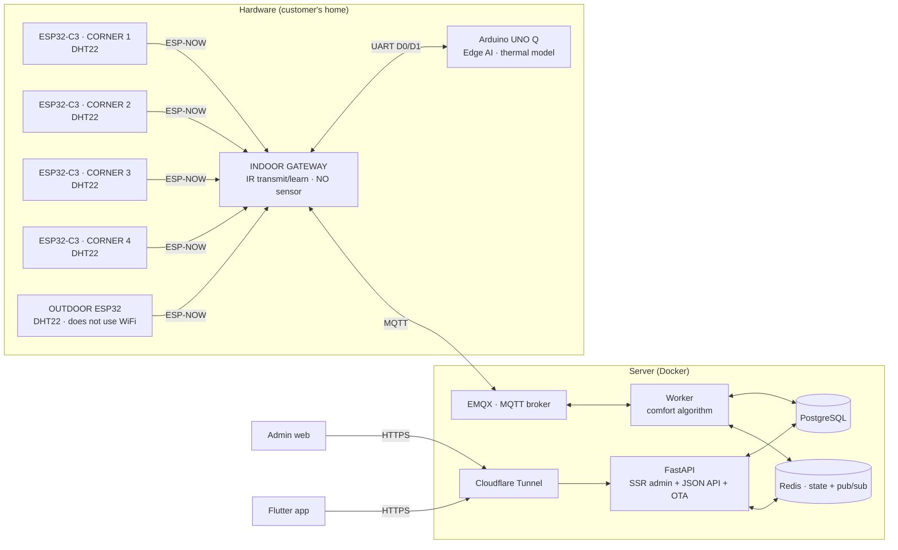

# BreezeLink — Adaptive air conditioning system

BreezeLink controls air conditioning **adaptively to the climate**: ESP32 sensors measure
temperature/humidity in the four corners of a room and outdoors, a comfort algorithm computes an
energy-saving setpoint, and the user drives the air conditioner from a phone app. The vendor
manages customers, devices and software releases through a separate web UI.

The difference from an ordinary thermostat: **the system keeps running when the internet is
down**. A small computer in the house (an Arduino UNO Q) holds a copy of the algorithm, learns the
thermal model of that particular room, and drives the air conditioner itself when the server has
been silent for too long.

The project has five parts sharing one backend:

- **Admin web** (SSR, for the **vendor**) — manage customers, issue activation codes, manage
  nodes, tune the algorithm, publish OTA releases.
- **Flutter app** (for the **customer**) — activate with a code, view live readings, control the
  air conditioner, self-update over OTA.
- **API + Worker** (FastAPI + MQTT) — serves both web and app from **a single business layer**, so
  the numbers on the web and in the app can never disagree.
- **ESP32 firmware** (6 devices per household) — **4 sensor nodes** in the room corners
  (ESP32-C3 + DHT22) and **1 outdoor node**, all broadcasting ESP-NOW to **1 gateway** mounted near
  the air conditioner; the gateway transmits infrared and bridges to the cloud — **it does not
  measure temperature**.
- **Edge AI** (Arduino UNO Q) — connected to the gateway over **UART**, learns the room's thermal
  model, and **drives the air conditioner itself when the cloud connection is lost**; normally it
  only advises.

---

## Table of contents

- [Features](#features)
- [Architecture](#architecture)
- [The comfort algorithm](#the-comfort-algorithm)
- [Edge AI: the room's thermal model](#edge-ai-the-rooms-thermal-model)
- [Technology](#technology)
- [Project layout](#project-layout)
- [Running locally](#running-locally)
- [Environment variables](#environment-variables)
- [Deployment](#deployment)
- [User guide](#user-guide)
- [Security](#security)

---

## Features

### Admin web (vendor)

- **Overview** — every node sold, across all customers, grouped by customer (sorted A→Z,
  collapsible), with an online/offline status chart.
- **Customers & Devices** — sell a product (create customer + nodes + activation code), manage
  nodes, issue more codes, view each node's readings, look up a customer by phone number.
- **Algorithm configuration** — tune the comfort parameters **per customer**.
- **App versions** — upload an APK, publish over OTA, view history, roll back.
- **Settings** — switch between Light / Dark / System themes.
- Realtime updates over WebSocket. Pages **patch the DOM in place** rather than re-rendering, so
  lists do not flicker, do not collapse themselves, and do not wipe out half-typed text when new
  data arrives.

### Customer app (Flutter)

- **Activation by code** — enter the code issued at purchase to create an account.
- **Dashboard** — the current setpoint plus the computation chain behind it (verifiable).
- **Control** — pick a mode, override manually, learn infrared codes (IR learn).
- **Discrete remote buttons** — fan speed, sleep, eco, swing… and **two humidifier buttons**
  (`HUMID_ON`/`HUMID_OFF`). The app is where all these codes are **taught**; the panel is where
  they get used to run autonomously.
- **Live readings** — indoor/outdoor, with historical charts.
- **OTA self-update** — announces a new version, downloads and installs it directly.

### Local control panel (the gateway's screen)

A 2.8" touch screen on the wall-mounted panel, **five pages**, usable with no network: indoor
temperature/humidity (median of the corners) and outdoor, air conditioner control, **humidifier**,
an 8-line diagnostics page (WiFi, MQTT, **per-corner** temperature, IR code count, firmware
version), the list of learned IR codes, and a log of the last 8 commands.

The room-corner page distinguishes `—` (corner offline) from `??` (corner alive but sensor
faulty) — two cases that call for entirely different actions.

**While automatic mode is running the adjustment buttons are locked.** `±` and the four mode
buttons are dimmed until **THỦ CÔNG** (manual) is pressed. They used to remain pressable but sent
nothing anywhere, and the next comfort cycle pulled the number back — the user saw the machine
obey for a few seconds and then change its mind, and read that as a broken board.

**Fan speed and the humidifier run on codes learned from the app.** Both are *discrete buttons*
in the `ir_action_codes` table: the app teaches the code once, the panel keeps a copy in NVS and
transmits it directly — so they keep working with no network, unlike the app which has to go
through the server.

### Edge AI monitoring page (port 7000)

Served directly from the UNO Q, not over the internet: the 4 corner temperatures, who is currently
in control, **the room's time constant**, measured cooling power, forecast error against a "room
stands still" baseline, a chart of the last 6 hours and the weather forecast for the next 12.

The page **loads nothing from outside** — no CDN, no web fonts, charts drawn by hand on a canvas. A
monitoring page that only renders when the internet is up is the thing that breaks exactly when it
is needed most.

---

## Architecture



**Data flow:** the four room-corner nodes and the outdoor node broadcast their readings over
ESP-NOW to the gateway; the gateway pushes them to MQTT **on each node's behalf** → the worker
stores the history (Postgres), takes the **median** of the fresh corners as the indoor temperature
(Redis) and computes the setpoint → sends an IR command back to the gateway. The Cloudflare Tunnel
is the only path in from the internet — no port is bound to `0.0.0.0`.

### Why four sensors and not one

A single wall-mounted sensor does not tell you the temperature of the room, it tells you the
temperature of **that wall**. A corner in direct sun, a corner under the air outlet and a corner
behind a cabinet routinely differ by 3–4 °C.

The backend takes the **median**, not the mean — so one anomalous corner cannot drag the setpoint
away. A mean can, permanently, and the only symptom is "it just feels wrong in here".

### Why the sensors use ESP-NOW

An ESP-NOW frame carries 250 bytes, so each node carries its own 32-character `device_uuid`
directly — the gateway **keeps no lookup table**, and adding or removing a corner only means
flashing a new board.

A classic BLE advertising packet is only 31 bytes, not enough for the uuid, so it would force the
gateway to keep a uuid array and be reflashed every time a node changes. One slot out of place and
corner A's readings land in the cloud under corner B's name — the charts still show numbers and
nothing anywhere reports an error.

The same applies to the outdoor node: it only needs to send 43 bytes every 5 seconds, and ESP-NOW
avoids the whole WiFi/DHCP/TCP handshake so it uses considerably less power. It also **needs no
MQTT account of its own** — the gateway publishes on its behalf.

### Why the gateway ↔ UNO Q link is UART and not Bluetooth

The first version used BLE GATT. Measured on real hardware:

```
Gateway, BLE on:    0.31 ESP-NOW packets/second
Gateway, BLE off:   0.80 packets/second      ← exactly 4 nodes × 5 seconds
```

Turning on Bluetooth **forces** the ESP32 to enable WiFi sleep — it `abort()`s rather than merely
degrading. With the radio asleep, an ESP-NOW frame arriving at that moment is lost, nothing buffers
it, and since broadcast has no ACK the node still reports "sent". The outdoor node dropped ~50 % of
its packets and flickered between ONLINE and OFFLINE.

In other words, the BLE link ate **~60 % of the receive capacity of the very gateway it was
serving**. UART does not touch the radio, so all of it comes back. The price is one wire, and the
two boards have to sit next to each other.

It also removes a pile of associated complexity: no scanning, no pairing, no MTU negotiation, no
~100 KB of NimBLE flash, nobody competing for the 2.4 GHz antenna.

> **Wiring** (cross-checked against the official pinout:
> <https://docs.arduino.cc/hardware/uno-q> — datasheet ABX00162):
> `GPIO18 → D0` (PB7, USART1_RX) · `GPIO17 ← D1` (PB6, USART1_TX) · common GND.
>
> **Do not connect to the pins labelled "RX"/"TX"** on the other header — those are
> `SOC_SE4_RX/TX`, they go straight into the Qualcomm SoC and run at **1.8 V**. The numbered
> header has no RX/TX markings at all, which makes this a very easy mistake to make, and making
> it destroys an SoC pin.

### Why the UNO Q is not connected over MQTT

A fallback layer has to survive exactly the failure it was built for. Going through a broker means
that when the network drops — exactly when it is needed most — it also loses its path to the
gateway. UART is a direct wire between two boards sitting next to each other: no router, no
internet, no broker.

### Two radios on one antenna

The gateway runs WiFi/MQTT and ESP-NOW simultaneously on the same 2.4 GHz block. The gateway
**does not scan for WiFi** while running (scanning is what eats airtime continuously), and the main
loop **never blocks**: `serviceNetwork()` retries the connection on a schedule and returns
immediately. An earlier version called `connectWifi()` directly from `loop()`, and losing WiFi
killed ESP-NOW, UART and infrared along with it.

---

## The comfort algorithm

The setpoint is computed from the **adaptive comfort** model (de Dear & Brager, ASHRAE RP-884),
not from a fixed number:

1. **Running-mean outdoor temperature** (`T_rm`) — smoothed with an EMA (`ema_alpha`).
2. **Neutral point** — `T_neutral = 0.31 · T_rm + 17.8` (valid for `10 ≤ T_rm ≤ 33.5`).
3. **Humidity compensation** — no penalty below 60%RH; a progressive subtraction from 60–75% per
   `humid_slope`; a steeper penalty above 75% (sweat evaporates less effectively).
4. **Night schedule** — add `night_offset` within the `night_start`→`night_end` window.
5. **Safety limits** — clamp to `[clamp_min, clamp_max]`.
6. **Snap to an IR code** — round to the nearest temperature that household has **actually learned
   a code for**.

The parameters in steps 1, 3, 4 and 5 are tunable **per customer**. The regression constants
(0.31 / 17.8) are fixed science and are not tunable.

`clamp_min`/`clamp_max` are adjustable, **but must stay within 16–30 °C** — that is the air
conditioner's own range, not a preference: the remote only has those levels, so only those levels
have IR codes to learn, and the panel encodes exactly that range into 15 bits. The rule lives in
`AC_TEMP_MIN`/`AC_TEMP_MAX` (`src/app/comfort/comfort_constants.py`) and is enforced both in the
`/configs` API and in the admin web form.

Three layers of oscillation control: the input EMA, `deadband` (hysteresis around the setpoint),
and `dwell_sec` (minimum time in a mode) which protects the compressor from continuous cycling.

> A `clamp_max` **above 28.7 °C has no effect**: the RP-884 formula clamps `T_rm` at 33.5, so
> `T_neutral` never exceeds `0.31 × 33.5 + 17.8 = 28.185`; adding `night_offset` puts the real
> ceiling at 28.685.

---

## Edge AI: the room's thermal model

Runs on the Linux half of the Arduino UNO Q. **One model, four parameters:**

```
T_in[k+1] = a·T_in[k] + b·T_out[k] + c·u[k] + d

u[k] = max(0, T_in[k] − T_set[k])  when in COOL, otherwise 0
```

Three physical numbers can be extracted — something a black-box model cannot give you:

| | Meaning |
|---|---|
| `τ = −Δt/ln(a)` | the room's time constant |
| `b/(1−a)` | how much outdoor sun makes it into the room |
| `−c/(1−a)` | actual cooling power — **a steady decline means the unit is weakening or the filter is dirty** |

### Why exactly four parameters

This is a constraint of the **data**, not a preference. Looking at "12,644 data points" and
concluding it is enough for a neural network is wrong, because the points are not independent: two
readings a minute apart in a room whose time constant is tens of minutes are essentially the same
number.

The number of **independent** samples ≈ duration ÷ τ. Two days of four-corner data ÷ τ≈45 minutes
≈ **60 independent thermal events**. An MLP of 32→64→3 has ~2,400 parameters — roughly **two
years** of accumulation at the current rate.

### Three different cadences

| Layer | Cadence |
|---|---|
| Gateway pushes a snapshot | 5 seconds |
| Written to history | 60 seconds (averaging 12 snapshots) |
| Model update | 300 seconds (taking every 5th sample) |

The last two are **not arbitrary**. Measured on synthetic data with a known answer (true τ of 45
minutes):

```
Δt = 60s, no averaging:      τ = 24 minutes   (47% error)
Δt = 300s, with averaging:   τ = 47 minutes   ( 5% error)
```

The cause is **attenuation bias** (errors-in-variables): sensor noise sits inside the regressor
`T_in[k]` itself, so it pulls `a` down **systematically**. The other two coefficients are almost
untouched, which makes the symptom very easy to overlook. Averaging 12 samples cuts the noise by
√12 ≈ 3.5×; a 300-second step gives 5× the signal of a 60-second step.

### Advice only, until it proves itself

`PredictionScore` scores every 15-minute forecast against the **"room stands still" baseline**, and
only reports `ĐÁNG TIN` (trustworthy) when the error is < 0.3 °C **and** it beats that baseline by
at least 20%. A model that merely matches the baseline makes all of its computation pointless,
however small the absolute error sounds.

Until then — and whenever `EDGE_ADVISORY_ONLY=1` — the node **sends advice only**. The gateway only
fires infrared on `kind=COMMAND`; every branch that does not qualify falls back safely to `ADVICE`
instead of relying on someone remembering to block it.

### Who is allowed to issue commands

Deliberately asymmetric: **take control** only after 300 seconds of server silence, **release
control** the instant the gateway hears the server return. Taking over late costs a few minutes
without adaptation; releasing late means both sides fight over the compressor. Those two costs are
not equal.

The silence is measured **by the gateway** — it holds the MQTT session, so it knows more reliably.

### Local history

SQLite stored next to the service (`python/data/`), ~30 MB/year at one sample per minute.
`synchronous=FULL`, not `NORMAL`: measured in practice, WAL at NORMAL only fsyncs every
**~5.5 hours** — meaning a power cut could lose the entire learning process. At FULL, a power cut
loses at most the sample being written.

On restart the model **replays the whole history**: with 120 pairs available it does a single batch
fit, otherwise it replays sample by sample through RLS. So accumulated learning time **adds up**
across power cuts instead of resetting to zero.

---

## Technology

| Layer | Technology |
|---|---|
| Backend | Python 3.12, FastAPI, SQLAlchemy 2 (async), Alembic |
| DB / cache | PostgreSQL 15, Redis 7 |
| IoT | MQTT (EMQX 5), paho-mqtt |
| App | Flutter (Dart), Dio, package_info_plus, url_launcher |
| Firmware | C++ (Arduino-ESP32), PlatformIO, LVGL 8 + TFT_eSPI, IRremoteESP8266, ESP-NOW |
| Edge AI | Python 3.13, numpy, SQLite, Arduino App Lab (`web_ui`, RouterBridge) |
| Hardware | ESP32-S3 (gateway/panel) · **5× ESP32-C3** (4 room corners + outdoor) · Arduino UNO Q · DHT22 · IR LED |
| Infrastructure | Docker Compose, Cloudflare Tunnel |
| Admin web | SSR Jinja2 + the "Titanium Command" design system (plain CSS, no CDN) |

---

## Project layout

```
AirConditioner/
├── src/app/               # FastAPI backend
│   ├── api/               #   JSON API (/api/v1) + public OTA (/app)
│   ├── web/               #   SSR admin (/web): routes, templates, static
│   ├── services/          #   Business layer (shared by web + app)
│   ├── comfort/           #   Setpoint algorithm + running-mean
│   ├── workers/           #   MQTT worker (comfort loop, IR)
│   ├── models/            #   ORM (SQLAlchemy)
│   └── alembic/           #   DB migrations
├── app-flutter/           # Customer app (Flutter)
├── Firmware/              # ESP32 firmware (PlatformIO)
│   ├── esp32-s3-panel/    #   THE OFFICIAL WALL PANEL (2.8" ESP32-S3 board)
│   │   ├── src/           #     PANEL SOURCE — the ONLY copy, shared by all 3 envs
│   │   │   ├── ui/        #       LVGL interface (runs on core 0)
│   │   │   ├── ir-*        #       IR transmit/learn + code store in NVS
│   │   │   ├── unoq-link.* #       UART link to the Arduino UNO Q
│   │   │   ├── board-pins.h #      PER-BOARD pinout, selected with -D BOARD_* flags
│   │   │   └── room-registry.*  #  4-corner table + median
│   │   └── tools/         #     VLW font / LVGL image generation, serial reader
│   ├── esp32-room/        #   4 ROOM-CORNER NODES (envs ss1..ss4, one UUID each)
│   ├── esp32-outdoor/     #   OUTDOOR node (ESP32-C3, ESP-NOW slave)
│   ├── shared/            #   ESP-NOW packet layout + slave radio + UART protocol to the UNO Q
│   └── Interface/         #   UI design + pinout
├── edge-ai/               # Edge AI service for the Arduino UNO Q
│   ├── edge_ai/           #   thermal_model, history_store, weather, dashboard,
│   │                      #   prediction_score, cloud_watch, controller, bridge_client
│   ├── applab/BreezeLink/ #   Arduino App Lab application (sketch + python + assets)
│   └── deploy/            #   Payload builder + systemd unit
├── Icon/                  # The source image every project icon is generated from
├── docker/                # Dockerfile + compose (local + vps)
├── scripts/               # deploy.sh, push-unoq-app.sh, seed_demo.py
└── docs/                  # Design documentation
```

---

## Running locally

**Requirements:** Docker + Docker Compose. (Running the app also needs the Flutter SDK.)

### 1. Backend + admin web

```bash
cp .env.example .env
#   change JWT_SECRET and MQTT_PASS to your own values
#   (the app refuses to start if JWT_SECRET is still the default)

docker compose -f docker/docker-compose.yml up -d --build

# demo data — scripts/ is not in the image, so pipe it in over stdin.
# DEMO_PASSWORD is mandatory: the script deliberately has no default password, because a
# role=owner login pair hard-coded in the source is usable by anyone who reads the repo.
# The MQTT tokens for the two demo devices are generated randomly and printed once.
docker compose -f docker/docker-compose.yml exec -T \
  -e DEMO_PASSWORD='set-your-own-password' \
  api python - < scripts/seed_demo.py
```

- Admin web: **http://localhost:8201/web/login**
- API docs: **http://localhost:8201/docs**
- The `alembic upgrade head` migration **runs automatically** when the API container starts.

### 2. Flutter app

```bash
cd app-flutter
flutter pub get
flutter run
# The server address is supplied AT BUILD TIME — never hard-coded (this is a public repo).
# Forget this flag and the APK still builds, but the "server address" field on the login
# screen is empty, and the app says so plainly instead of blaming the network.
flutter build apk --release \n    --dart-define=BREEZELINK_BASE_URL=https://admin.your-domain.com
#   -> build/app/outputs/flutter-apk/app-release.apk
```

**Changing the icon across the whole project:** replace `Icon/1.png`, then

```bash
python scripts/generate-icons.py            # generates 25 files: web favicon, iOS, PWA, the :7000 page
python scripts/generate-icons.py --check    # list only, do not overwrite
cd app-flutter && dart run flutter_launcher_icons   # Android specifically has an adaptive layer
```

The script finds the crop square itself using a distance transform and **preserves each file's
existing dimensions** — every platform has its own rules, and resizing one file breaks exactly that
platform in a way that only surfaces at packaging time.

### 3. ESP32 firmware

`config.h` is **not in the repo** (ignored because it holds the WiFi password + MQTT token). Get the
values from the admin web → *Khách hàng* → open the node → **"Nạp firmware"**.

```bash
# GATEWAY / wall PANEL
cd Firmware/esp32-s3-panel && pio run -e esp32s3-panel -t upload

# 4 ROOM-CORNER NODES — nodes.ini declares each board, flash them in turn
cd Firmware/esp32-room
cp nodes.ini.example nodes.ini    # fill in each corner's DEVICE_UUID
pio run -e ss1 -t upload && pio run -e ss2 -t upload   # ...ss3, ss4

# OUTDOOR NODE
cd Firmware/esp32-outdoor && pio run -e esp32-espnow -t upload
```

The six biggest time sinks if you do not know them in advance:

- **Every room-corner node needs its own `DEVICE_UUID`.** `ROOM_CORNER` is only a **display
  label**; two boards sharing a corner number is harmless.
- **`WIFI_SSID` must be identical on ALL SIX devices** and must be a 2.4 GHz network. The sensor
  nodes do not join WiFi — they only *scan* for this exact name to learn which channel the router
  is on, because ESP-NOW requires every party on the same channel. One wrong character and the
  frames go nowhere, and since broadcast has **no ACK** not a single log line reports it.
- **Set the C3 nodes' transmit power to 8 dBm, not 19.5 dBm.** The high setting on a USB-powered
  board produces distorted output that cannot be decoded — the gateway receives 0 packets, exactly
  as if a wire were broken.
- **The QR Box board needs its own 9–24 VDC supply on P2/P4.** A USB-TTL on P3 alone is enough to
  flash it but cannot power the display while running. Tell them apart by the reset code:
  `POWERON_RESET` is a power problem, `SW_CPU_RESET` is a software one.
- **IR codes live in NVS** and survive reflashing — but `erase_flash` wipes them all.
- **Do not run `pio pkg install`**: it rewrites `platformio.ini` and strips every comment.

```bash
pio device monitor -p COMx -b 115200    # RESETS the board -> lets you see the boot log

# does NOT reset -> preserves accumulated state, use this while debugging
python Firmware/esp32-s3-panel/tools/read_serial.py COMx 30
```

### 4. Edge AI on the Arduino UNO Q

Runs as an **Arduino App Lab** application:

```bash
python edge-ai/deploy/build-applab-app.py      # bundles edge_ai + the comfort slice
bash scripts/push-unoq-app.sh edge-ai/applab/BreezeLink
```

Then press **Run** in App Lab. The monitoring page is at `http://<board-ip>:7000`.

Configuration lives in `edge-ai/applab/BreezeLink/python/.env` (**not** in git):

| Variable | Meaning |
|---|---|
| `EDGE_ORG_ID` | Hashed into the `link_key` the gateway checks. One wrong character and every command is refused **silently**. |
| `EDGE_IR_TEMPS` | The COOL levels this household has learned codes for. Leave it empty and the edge learns them by observation — and a half-filled list is **more dangerous** than an empty one. |
| `EDGE_COMFORT_CONFIG` | The household's real comfort configuration. Leave it empty and the edge computes with defaults and **silently diverges** from the server. |
| `EDGE_LAT` / `EDGE_LON` | Coordinates used to fetch the weather forecast. |
| `EDGE_ADVISORY_ONLY` | `1` = advice only, never fire IR. |

---

## Environment variables

Declared in `.env` (see `.env.example`). The important ones:

| Variable | Meaning |
|---|---|
| `JWT_SECRET` | **Must be changed.** The app refuses to start while it is still `change-me-in-production`. |
| `DB_URL` | PostgreSQL connection string (async). |
| `REDIS_URL` | Redis connection. |
| `MQTT_HOST` / `MQTT_PORT` / `MQTT_PASS` | MQTT broker connection. |
| `SMTP_*` | Sending email (password resets, notifications). |
| `CF_TUNNEL_TOKEN` | Cloudflare Tunnel token — only in `docker/.env` on the server, **never** committed. |
| `MQTT_PUBLIC_HOST` | The MQTT host IP/name that the **firmware** connects to. Also in `docker/.env`; compose **refuses to start** if it is missing, rather than running with an empty value. |

---

## Deployment

`scripts/deploy.sh` syncs **only the `src/` directory**, rebuilds the container and runs a health
check — and **never touches `docker/.env`** (the tunnel token).

The server address is **not in the code** — copy the template and fill it in:

```bash
cp scripts/deploy.env.example scripts/deploy.env   # AC_HOST / AC_USER / AC_URL
```

```bash
scripts/deploy.sh              # asks for confirmation
scripts/deploy.sh --yes        # no prompt
AC_HOST=1.2.3.4 scripts/deploy.sh   # environment variables still win over the file above
```

If the configuration is missing the script **stops immediately** and says which variable is absent,
rather than running as far as `ssh` and hanging on an empty hostname — an error that reads as "the
network is broken".

Each deployment interrupts service for ~30–40 seconds (cloudflared restarts). The script waits up
to 60 seconds for the tunnel to reattach before drawing a conclusion — querying once immediately
afterwards is almost guaranteed to hit a 502 and report a successful deployment as a failure.

> **Editing `app.css` or `app.js` requires nothing extra.** The `?v=` cache-buster is hashed from
> the file contents, so it changes itself. It used to be a hand-typed constant, and that once left
> a deployed fix running the old version in browsers for another 4 hours.

### Changing the domain

**Devices are unaffected** — the ESP32s connect to MQTT by **bare IP**, not by domain name.

> ⚠️ **Apps already installed on customers' phones are the dangerous part.** The app stores the
> base URL in `SharedPreferences`, and **a stored value always wins over the default**. Publishing a
> new build with a new `_kDefaultBaseUrl` **does not rescue existing customers** — the new build has
> to include a **one-time migration**. And if you shut down the old domain before customers have
> updated, they also lose their route to the fix, because `/app/update.json` lives on that same dead
> domain.

The safe procedure — the key point is that **one Cloudflare Tunnel can serve several hostnames**:

1. Add the new hostname to **the tunnel that is already running** → both names live at once
2. Change `RESET_PASSWORD_URL_BASE` + `SMTP_FROM` in `docker/.env`, restart the api
3. Publish the new app (new default + the migration) — **over the old domain, while it still works**
4. Watch the **app version** column in the admin web to see which customers have upgraded
5. Only remove the old hostname once nobody is on the old build

If you have not sold to anyone yet, skip all five steps and just change it.

---

## User guide

### Vendor (web)

1. **Log in** at `/web/login`.
2. **Sell a product** — *Khách hàng & Máy* → "Tạo sản phẩm + sinh mã", enter the node count.
3. **Give the customer the code** — they enter it in the app; name, phone and email **appear
   automatically** on the web UI.
4. **Manage** — edit/add/remove nodes, issue more codes, adjust the algorithm configuration, view
   readings.
5. **Publish the app** — *Phiên bản app* → upload an APK with an increasing version code.

### Customer (app)

1. Install the app → "Mới mua máy? Kích hoạt bằng mã".
2. Enter the **activation code** + email + password → the account is created.
3. Use the dashboard to see the setpoint, live readings, and to control the air conditioner.
4. When an update exists, the app shows a download dialog automatically.

---

## Security

- Real secrets (**tunnel token, JWT secret, DB password, MQTT**) live in `.env` / `docker/.env` —
  **kept out of the repo by `.gitignore`**.
- **`Firmware/*/src/config.h` and `esp32-room/nodes.ini` are ignored** — each node holds the
  customer's WiFi password and its own `DEVICE_UUID`/`MQTT_PASSWORD` pair.
- **`edge-ai/applab/BreezeLink/python/.env` is ignored** — it holds the household's `EDGE_ORG_ID`.
- APKs, the app signing keystore and private keys are all ignored.
- The admin web is **staff only** (`is_sysadmin`); customers use the app.
- Deleting a customer requires typing the name to confirm (cascading, not undoable).
- The `link_key` between the UNO Q and the gateway **is not authentication** — it stops another
  household's UNO Q from connecting by accident, not a deliberate attacker. The threat here (someone
  with hands on the UART cable inside your house) does not justify the cost of hardening it.

> If you deploy your own instance, create `docker/.env` **directly on the server** with your own
> `CF_TUNNEL_TOKEN`, `JWT_SECRET`, `POSTGRES_PASSWORD`… — do not commit it.

---

## Licence

[MIT](LICENSE) — use, modify and redistribute it, including commercially; just keep the copyright
line.

**Not included in the repo** (kept locally, not redistributed because they belong to third
parties):

| Document | Where to get it |
|---|---|
| ASHRAE 55 — adaptive comfort | <https://www.ashrae.org> (a copyrighted standard, must be purchased) |
| Arduino UNO Q — datasheet, pinout, schematic | <https://docs.arduino.cc/hardware/uno-q> |
| Touch screen schematic | the board supplier |

The comfort algorithm in `src/app/comfort/` is an implementation **of a published model** (de Dear
& Brager, ASHRAE RP-884) — the regression constants `0.31` / `17.8` are public science, not content
copied from the standard.
