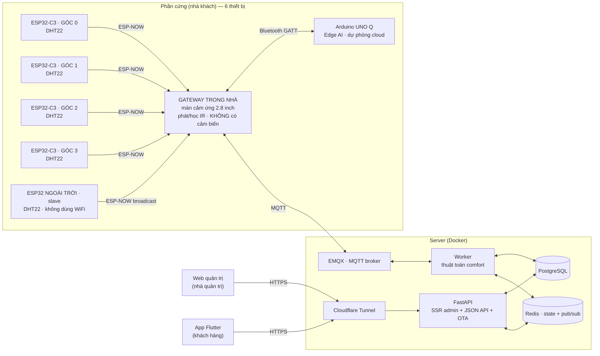

# Aircon — Hệ thống điều hoà thích ứng

Aircon là hệ thống điều khiển điều hoà **thích ứng theo khí hậu**: cảm biến ESP32 đo
nhiệt độ/độ ẩm trong và ngoài nhà, một thuật toán comfort tính ra nhiệt độ đặt tiết kiệm
điện, và người dùng điều khiển máy lạnh qua ứng dụng điện thoại. Nhà quản trị (bên bán)
quản lý khách hàng, thiết bị và phát hành bản cập nhật app qua một trang web riêng.

Dự án gồm năm phần chạy chung một backend:

- **Web quản trị** (SSR, dành cho **nhà quản trị/bên bán**) — quản lý khách hàng, cấp mã
  kích hoạt, quản lý node, tinh chỉnh thuật toán, phát hành OTA.
- **App Flutter** (dành cho **khách hàng**) — kích hoạt bằng mã, xem số đo trực tiếp,
  điều khiển điều hoà, tự cập nhật qua OTA.
- **API + Worker** (FastAPI + MQTT) — phục vụ cả web lẫn app từ **một tầng nghiệp vụ duy
  nhất**, nên số liệu trên web và trên app không bao giờ lệch nhau.
- **Firmware ESP32** (6 thiết bị mỗi hộ) — **4 node cảm biến** ở bốn góc phòng
  (ESP32-C3 + DHT22) và **1 node ngoài trời**, tất cả bắn ESP-NOW về **1 gateway**
  đặt gần máy lạnh; gateway mang màn cảm ứng 2.8", phát hồng ngoại và làm cầu nối
  lên cloud — **nó không đo nhiệt độ**.
- **Edge AI** (Arduino UNO Q) — nối gateway qua **Bluetooth**, tính comfort ngay
  trong nhà và **tự lái máy lạnh khi mất kết nối cloud**; bình thường chỉ đề xuất.

---

## Mục lục

- [Tính năng](#tính-năng)
- [Kiến trúc](#kiến-trúc)
- [Thuật toán comfort](#thuật-toán-comfort)
- [Công nghệ](#công-nghệ)
- [Cấu trúc dự án](#cấu-trúc-dự-án)
- [Chạy trên máy local](#chạy-trên-máy-local)
- [Biến môi trường](#biến-môi-trường)
- [Triển khai lên server](#triển-khai-lên-server)
- [Hướng dẫn sử dụng](#hướng-dẫn-sử-dụng)
- [Bảo mật](#bảo-mật)

---

## Tính năng

### Web quản trị (nhà quản trị)

- **Tổng quan (fleet view)** — toàn bộ node đã bán của mọi khách, gom theo khách hàng
  (xếp A→Z, gập/mở), kèm biểu đồ trạng thái trực tuyến/ngoại tuyến.
- **Khách hàng & Máy** — bán sản phẩm (tạo khách + node + mã kích hoạt), quản lý node
  (thêm/sửa/xoá), cấp thêm mã, xoá mã dư, xem số đo từng node, tìm khách theo SĐT.
- **Cấu hình thuật toán** — tinh chỉnh tham số comfort cho **từng khách**.
- **Phiên bản app** — tải APK lên, phát hành OTA, xem lịch sử, rollback.
- **Quản trị viên** — thêm/xoá tài khoản nhân viên.
- Cập nhật realtime qua WebSocket, lưu không tải lại trang (AJAX + xác nhận trong app).

### App khách hàng (Flutter)

- **Kích hoạt bằng mã** — nhập mã được cấp khi mua máy để tạo tài khoản (nhập tên, SĐT,
  email; thông tin tự hiện trên web quản trị).
- **Bảng điều khiển** — nhiệt độ đặt hiện tại + chuỗi tính toán (có thể kiểm chứng).
- **Điều khiển** — chọn chế độ, ghi đè thủ công, học mã điều khiển hồng ngoại (IR learn).
- **Số đo trực tiếp** — trong/ngoài nhà, biểu đồ lịch sử.
- **Tự cập nhật OTA** — báo có bản mới, tải và cài trực tiếp.

### Bảng điều khiển tại chỗ (gateway trong nhà)

Màn cảm ứng 2.8" trên gateway, dùng được cả khi mất mạng:

- **Trang chủ** — nhiệt/ẩm trong nhà (trung vị các góc) và ngoài trời, chế độ + nhiệt độ
  đặt hiện tại, huy hiệu cho biết đang **TỰ ĐỘNG** hay **GHI ĐÈ**. Thiếu góc nào thì hiện
  thêm "3/4 GÓC" — đủ góc thì nhãn đó biến mất hẳn.
- **Điều khiển** — chọn chế độ, chỉnh nhiệt độ, bắn hồng ngoại ngay tại chỗ. Tổ hợp chưa
  học mã thì nút bị làm mờ, không có phím chết.
- **Thông tin** — 8 dòng chẩn đoán: WiFi, IP, sóng, MQTT, **nhiệt độ từng góc phòng**,
  tuổi số đo ngoài trời, số mã IR, phiên bản firmware. Dòng góc phòng phân biệt "—" (góc
  mất kết nối) với "??" (góc còn sống nhưng cảm biến hỏng) — hai ca dẫn tới hai việc phải
  làm khác hẳn nhau.
- **Cài đặt** — độ sáng (giữ để chạy nhanh), âm báo, khởi động lại, **danh sách mã IR đã
  học** (xoá được từng mã), **nhật ký 8 lệnh gần nhất** từ máy chủ kèm kết quả thi hành.

Mọi thao tác khó lùi đều hỏi lại bằng một hộp xác nhận nêu đích danh việc sắp làm.

### Điểm nổi bật kỹ thuật

- **Một tầng nghiệp vụ, hai giao diện** — web SSR và app JSON dùng chung service, số liệu
  không trôi lệch.
- **Đa khách hàng (multi-tenant)** — mọi truy vấn khoá theo tổ chức; nhà quản trị là vai
  trò duy nhất nhìn xuyên khách hàng (cờ `is_sysadmin`).
- **OTA cho app** — APK lưu trên volume Docker, sống sót qua mỗi lần deploy.
- **Kích hoạt bằng mã một lần** — chống tương tranh bằng khoá hàng (`SELECT ... FOR
  UPDATE`), một mã chỉ tạo được một tài khoản.

---

## Kiến trúc



**Luồng dữ liệu:** bốn node góc phòng và node ngoài trời đều bắn số đo qua ESP-NOW về
gateway; gateway đứng tên **từng node** đẩy lên MQTT → worker lưu
lịch sử (Postgres), lấy **trung vị** các góc còn tươi làm nhiệt độ trong nhà (Redis) và
tính nhiệt độ đặt → phát lệnh IR về gateway. API phục vụ web + app; Redis pub/sub đẩy cập
nhật realtime tới WebSocket. Cloudflare Tunnel là đường duy nhất từ internet vào — không
cổng nào mở ra `0.0.0.0`.

**Vì sao bốn cảm biến chứ không một:** một cảm biến treo tường không nói được nhiệt độ của
phòng, nó nói nhiệt độ của **cái tường đó**. Góc có nắng chiếu, góc dưới miệng gió và góc
sau tủ chênh nhau 3–4 °C là chuyện thường. Backend lấy **trung vị** (không phải trung bình
cộng) nên một góc bất thường không kéo được nhiệt độ đặt đi — trung bình cộng thì có, vĩnh
viễn, và triệu chứng duy nhất là "ở trong nhà thấy sai sai".

**Vì sao mọi cảm biến đi ESP-NOW, còn Bluetooth chỉ dành cho UNO Q:** gói ESP-NOW chở
được 250 byte nên mỗi node mang thẳng `device_uuid` 32 ký tự của chính nó — gateway
**không giữ bảng tra nào**, thêm hay bớt một góc chỉ cần nạp bo mới. Gói BLE advertising
cổ điển chỉ có 31 byte, chở không nổi uuid, nên sẽ buộc gateway giữ một mảng uuid và nạp
lại mỗi lần đổi node; lệch một ô là số đo của góc A nộp lên cloud dưới tên góc B —
biểu đồ vẫn có số, không lỗi ở đâu cả.

Bluetooth thì đúng chỗ cho đường **gateway ↔ UNO Q**: nó **hai chiều** (UNO Q phải ra
lệnh ngược), và GATT thương lượng được MTU hàng trăm byte nên chở lọt ảnh chụp cả bốn góc.

**Vì sao UNO Q nối gateway bằng Bluetooth chứ không qua MQTT:** lớp dự phòng phải sống
sót đúng cái sự cố nó sinh ra để chịu đựng. Đi qua broker nghĩa là khi mất mạng — đúng
lúc cần nó nhất — nó cũng mất luôn đường tới gateway. BLE là liên kết trực tiếp giữa hai
thiết bị đặt cùng phòng: không router, không internet, không broker.

**Vì sao node ngoài trời không tự nối WiFi:** nó chỉ cần gửi 43 byte mỗi 15 giây. ESP-NOW
bỏ được toàn bộ bắt tay WiFi/DHCP/TCP nên tốn ít điện hơn hẳn (quan trọng nếu chạy pin), và
node đó **không cần tài khoản MQTT riêng** — gateway đứng tên publish hộ. Đổi lại,
mất gateway là mất luôn số ngoài trời; bản dự phòng tự nối WiFi vẫn còn trong repo
(`pio run -e esp32-wifi`) để tách lỗi khi ESP-NOW trục trặc.

**Ba radio trên một ăng-ten:** gateway chạy đồng thời WiFi/MQTT, ESP-NOW và BLE trên
cùng khối 2.4 GHz. Thứ tự ưu tiên được cài vào thiết kế: gateway **không quét BLE** — nó
chỉ quảng bá và giữ một kết nối GATT, còn quét mới là thứ ăn sóng liên tục. MQTT là
đường **duy nhất** để lệnh máy lạnh đi xuống nên nó được nhường trước.

**Vì sao node trong nhà nối MQTT trực tiếp:** lệnh từ backend mang `ir_raw` — mảng vài trăm
mốc thời gian µs, cỡ vài KB. ESP-NOW giới hạn 250 byte/gói nên trung chuyển qua master sẽ
phải tự viết giao thức chia mảnh; MQTT thì broker đã lo sẵn.

---

## Thuật toán comfort

Nhiệt độ đặt được tính theo mô hình **adaptive comfort** (de Dear & Brager, ASHRAE
RP-884), không phải một con số cố định:

1. **Trung bình trượt ngoài trời** (`T_rm`) — làm mượt nhiệt độ ngoài trời bằng EMA
   (trọng số `ema_alpha`), tránh nhảy theo từng biến động tức thời.
2. **Điểm trung tính** — `T_neutral = 0.31 · T_rm + 17.8` (hợp lệ khi `10 ≤ T_rm ≤ 33.5`).
3. **Bù trừ độ ẩm** — dưới 60%RH không phạt; 60–75% trừ dần theo `humid_slope`; trên 75%
   phạt nặng hơn (bay hơi mồ hôi kém hiệu quả).
4. **Lịch đêm** — cộng thêm `night_offset` trong khung giờ `night_start`→`night_end`.
5. **Giới hạn an toàn** — kẹp kết quả trong `[clamp_min, clamp_max]`.

Các tham số ở bước 1, 3, 4, 5 **tinh chỉnh được cho từng khách** trong trang *Cấu hình
thuật toán*. Hằng số hồi quy (0.31 / 17.8) là khoa học cố định, không chỉnh.

Chống dao động: `deadband` (vùng trễ quanh nhiệt độ đặt) + `dwell_sec` (thời gian giữ chế
độ tối thiểu) bảo vệ block máy nén khỏi bật/tắt liên tục.

---

## Công nghệ

| Lớp | Công nghệ |
|---|---|
| Backend | Python 3.12, FastAPI, SQLAlchemy 2 (async), Alembic |
| CSDL / cache | PostgreSQL 15, Redis 7 |
| IoT | MQTT (EMQX 5 / Mosquitto), paho-mqtt |
| App | Flutter (Dart), Dio, package_info_plus, url_launcher |
| Firmware | C++ (Arduino-ESP32), PlatformIO, LVGL 8 + TFT_eSPI, IRremoteESP8266, ESP-NOW, NimBLE |
| Edge AI | Python 3.11+, bleak (BLE) — chạy trên Debian của Arduino UNO Q |
| Phần cứng | ESP32-WROOM-32 (gateway) · 4× ESP32-C3-MINI-1 · ESP32 DevKit (ngoài trời) · Arduino UNO Q · màn ST7789 2.8" cảm ứng · DHT22 · DS1307 · LED IR |
| Hạ tầng | Docker Compose, Cloudflare Tunnel |
| Web admin | SSR Jinja2 + design system "Titanium Command" (CSS thuần, không CDN) |

---

## Cấu trúc dự án

```
AirConditioner/
├── src/app/               # Backend FastAPI
│   ├── api/               #   JSON API (/api/v1) + OTA công khai (/app)
│   ├── web/               #   SSR admin (/web): routes, templates, static
│   ├── services/          #   Tầng nghiệp vụ (dùng chung web + app)
│   ├── comfort/           #   Thuật toán setpoint + running-mean
│   ├── workers/           #   Worker MQTT (comfort loop, IR)
│   ├── models/            #   ORM (SQLAlchemy)
│   └── alembic/           #   Migration CSDL
├── app-flutter/           # App khách hàng (Flutter)
│   ├── lib/screens/       #   Màn hình: auth, dashboard, control, devices…
│   ├── lib/services/      #   API client, OTA, WebSocket…
│   └── assets/icon/       #   Icon app
├── FirmWare/              # Firmware ESP32 (PlatformIO)
│   ├── esp32-indoor/      #   GATEWAY: IR + màn + thu ESP-NOW + BLE tới UNO Q (KHÔNG cảm biến)
│   │   ├── src/ui/        #     Giao diện LVGL (chạy trên lõi 0)
│   │   ├── src/ir-*.{h,cpp}     #  Phát/học IR + kho mã trong NVS
│   │   ├── src/unoq-link.*      #  GATT server cho Arduino UNO Q
│   │   ├── src/room-registry.*  #  Bảng 4 góc + trung vị
│   │   └── tools/         #     Sinh font/ảnh LVGL, đọc log serial
│   ├── esp32-room/        #   4 NODE GÓC PHÒNG: ESP32-C3 + DHT22, slave ESP-NOW
│   ├── esp32-outdoor/     #   Node NGOÀI TRỜI: slave ESP-NOW (+ bản WiFi dự phòng)
│   ├── shared/            #   Khuôn gói ESP-NOW + radio slave + giao thức BLE với UNO Q
│   └── Interface/         #   Thiết kế giao diện + sơ đồ chân (README riêng)
├── edge-ai/               # Dịch vụ Edge AI cho Arduino UNO Q
│   ├── edge_ai/           #   room_store, predictor, cloud_watch, controller
│   └── deploy/            #   Unit systemd
├── docker/                # Dockerfile + compose (local + vps)
├── scripts/               # deploy.sh, seed_demo.py
├── docs/                  # Tài liệu thiết kế
└── .env.example           # Mẫu biến môi trường
```

---

## Chạy trên máy local

**Yêu cầu:** Docker + Docker Compose. (Chạy app cần thêm Flutter SDK.)

### 1. Backend + web quản trị

```bash
# 1. Tạo .env từ mẫu và ĐẶT JWT_SECRET thật (app từ chối chạy nếu còn giá trị mặc định)
cp .env.example .env
#   sửa JWT_SECRET và MQTT_PASS thành giá trị của bạn

# 2. Bật toàn bộ stack (Postgres, Redis, MQTT, API, Worker)
docker compose -f docker/docker-compose.yml up -d --build

# 3. Tạo dữ liệu demo (1 tài khoản quản trị + 1 khách mẫu)
#    scripts/ không nằm trong image nên đưa script vào python của container qua stdin:
docker compose -f docker/docker-compose.yml exec -T api python - < scripts/seed_demo.py
```

- Web quản trị: **http://localhost:8201/web/login**
- API docs (Swagger): **http://localhost:8201/docs**
- Migration `alembic upgrade head` **tự chạy** khi container API khởi động.

### 2. App Flutter

```bash
cd app-flutter
flutter pub get
flutter run                 # chạy trên máy/emulator
# hoặc build APK:
flutter build apk --release # -> build/app/outputs/flutter-apk/app-release.apk
```

App mặc định trỏ tới `https://admin.vi-du.com` — đổi trong màn đăng nhập, hoặc sửa
`_kDefaultBaseUrl` trong `lib/app/auth_gate.dart`.

### 3. Firmware ESP32

**Yêu cầu:** PlatformIO (CLI hoặc extension VS Code).

`config.h` **không có trong repo** (bị `.gitignore` vì chứa mật khẩu WiFi + token MQTT của
từng node). Lấy giá trị ở web quản trị → *Khách hàng* → mở node → mục **"Nạp firmware"**.

```bash
# 1) GATEWAY trong nhà (bo QR Box Advance, USB-TTL cắm vào cổng P3)
cd FirmWare/esp32-indoor
cp src/config.h.example src/config.h   # WiFi + ORG_ID/DEVICE_UUID/MQTT_PASSWORD
pio run -e qrbox-touch -t upload --upload-port COMx

# 2) BỐN node góc phòng (ESP32-C3-DevKitM-1) — nạp LẦN LƯỢT, mỗi bo một DEVICE_UUID
cd FirmWare/esp32-room
cp src/config.h.example src/config.h   # WIFI_SSID (chỉ để dò kênh) + DEVICE_UUID của góc 1
pio run -e esp32c3-room -t upload --upload-port COMy
#   đổi DEVICE_UUID (+ ROOM_CORNER, thuần nhãn) rồi nạp bo thứ hai, ba, tư.

# 3) Node ngoài trời (ESP32 DevKit V1) — MẶC ĐỊNH là bản ESP-NOW
cd FirmWare/esp32-outdoor
cp src/config.h.example src/config.h
pio run -e esp32-espnow -t upload --upload-port COMz
```

Năm điều dễ mất thời gian nhất nếu không biết trước:

- **Mỗi node góc phòng phải có `DEVICE_UUID` riêng** — lấy từ hàng devices của chính nó
  trên web. `ROOM_CORNER` thì chỉ là **nhãn hiển thị**, hai bo trùng số góc là vô hại:
  cả hai vẫn có topic riêng, vẫn vào trung vị, chỉ là màn ghi nhãn trùng nhau.
  *Kiểm chắc chắn:* trang chủ trên màn gateway phải hiện đủ số góc, và trang Thông tin
  liệt kê đủ ngần ấy nhiệt độ.
- **`WIFI_SSID` phải giống hệt nhau ở CẢ SÁU thiết bị** và phải là băng 2.4 GHz.
  Node cảm biến không đăng nhập WiFi — chúng chỉ *quét* đúng chuỗi tên này để biết
  router đang ở kênh nào, vì ESP-NOW bắt buộc mọi bên cùng kênh. Lệch một ký tự (hoặc
  điền tên băng 5 GHz) là node bám kênh mặc định, gói bay vào khoảng không, và vì
  broadcast **không có ACK** nên không một dòng log nào ở bất kỳ đâu báo lỗi.
- **Bo QR Box phải có nguồn riêng 9–24 VDC ở P2/P4.** Cắm mỗi USB-TTL vào P3 thì đủ để nạp
  nhưng không nuôi nổi màn lúc chạy — bo reset lặp và rất dễ chẩn đoán nhầm thành lỗi
  firmware. Phân biệt bằng mã reset: `POWERON_RESET` là nguồn, `SW_CPU_RESET` mới là phần mềm.
- **Mã IR sống trong NVS**, không mất khi nạp lại firmware (`pio run -t upload` không đụng
  phân vùng NVS) — nhưng `erase_flash` thì mất sạch.
- **Đừng chạy `pio pkg install`** để thêm thư viện: nó ghi đè `platformio.ini` và xoá hết
  chú thích. Thêm tay vào `lib_deps` rồi để `pio run` tự tải.

Xem log:

```bash
pio device monitor -p COMx -b 115200          # có RESET bo -> xem được log khởi động
python tools/read_serial.py COMx 30           # KHÔNG reset -> giữ trạng thái tích luỹ khi truy lỗi
```

---

## Biến môi trường

Khai báo trong `.env` (xem `.env.example`). Quan trọng nhất:

| Biến | Ý nghĩa |
|---|---|
| `JWT_SECRET` | **Bắt buộc đổi.** App từ chối khởi động nếu còn `change-me-in-production`. |
| `DB_URL` | Chuỗi kết nối PostgreSQL (async). |
| `REDIS_URL` | Kết nối Redis. |
| `MQTT_HOST` / `MQTT_PORT` / `MQTT_PASS` | Kết nối MQTT broker. |
| `SMTP_*` | Gửi email (đặt lại mật khẩu, thông báo). |
| `CF_TUNNEL_TOKEN` | Token Cloudflare Tunnel — chỉ trong `docker/.env` trên server, **không** commit. |

---

## Triển khai lên server

Script `scripts/deploy.sh` đồng bộ **chỉ thư mục `src/`**, rebuild container và kiểm tra
sức khoẻ — **không bao giờ đụng `docker/.env`** (token tunnel), có xác nhận trước khi chạy.

```bash
# deploy (hỏi xác nhận)
scripts/deploy.sh

# deploy không hỏi (dùng cho tự động hoá của bạn)
scripts/deploy.sh --yes

# đổi server đích qua biến môi trường
AC_HOST=1.2.3.4 AC_USER=user scripts/deploy.sh
```

Xác thực dùng SSH thông thường (khoá SSH hoặc gõ mật khẩu khi ssh hỏi) — **không** lưu mật
khẩu trong script. Mỗi lần deploy gây gián đoạn ~30–40 giây (cloudflared khởi động lại).

### Đổi tên miền

**Thiết bị không ảnh hưởng.** ESP32 nối MQTT bằng **IP trần** (`MQTT_PUBLIC_HOST`), không
qua tên miền — đổi domain thì hai node vẫn chạy y nguyên, không phải nạp lại. (Mặt trái:
đổi **IP của VPS** mới là việc phải đi nạp lại từng node.)

> ⚠️ **App đã cài trên máy khách mới là chỗ nguy hiểm.** App lưu base URL vào
> `SharedPreferences`, và **giá trị đã lưu luôn thắng giá trị mặc định**:
> `prefs.getString(_kBaseUrlKey) ?? _kDefaultBaseUrl`.
>
> Nên phát hành bản mới với `_kDefaultBaseUrl` mới **không cứu được khách cũ** — mặc định
> chỉ dùng khi chưa có gì được lưu. Bản mới phải kèm một đoạn **di trú một lần**: thấy URL
> đã lưu là domain cũ thì ghi đè thành domain mới.
>
> Và nếu tắt domain cũ trước khi khách kịp cập nhật thì họ mất luôn đường nhận bản sửa —
> `/app/update.json` cũng nằm ở đúng domain vừa chết. Không đẩy được bản vá qua chính cái
> kênh mà việc đổi domain vừa làm hỏng; khách phải tự gõ URL mới ở màn đăng nhập hoặc cài
> lại APK bằng tay.

Chín chỗ phải đổi:

| Chỗ | Ghi chú |
|---|---|
| **Cloudflare Tunnel ingress** | **Ngoài repo** — sửa trên dashboard. Đây mới là thứ thật sự định tuyến |
| `docker/.env`: `RESET_PASSWORD_URL_BASE` | Sai → link đặt lại mật khẩu trỏ vào domain chết |
| `docker/.env`: `SMTP_FROM` | Phải là sender **đã xác minh** ở nhà cung cấp SMTP — đổi domain là phải xác minh lại |
| `src/app/config.py` | Hai giá trị mặc định tương ứng |
| `app-flutter/lib/app/auth_gate.dart` | `_kDefaultBaseUrl` + đoạn di trú nói trên |
| `scripts/deploy.sh` | `AC_URL` — health-check ở cuối script |
| `src/app/main.py`, `README.md`, `scripts/seed_demo.py` | Tài liệu + tài khoản demo |

Cách làm an toàn — mấu chốt là **một Cloudflare Tunnel gắn được nhiều hostname**, tất cả
trỏ về cùng `http://localhost:8000`, nên hai tên chạy song song được mà không phải cắt đứt:

1. Thêm hostname mới vào **đúng tunnel đang chạy** → hai tên cùng sống
2. Đổi `RESET_PASSWORD_URL_BASE` + `SMTP_FROM` trong `docker/.env` trên server, restart api
3. Phát hành app mới (default mới + đoạn di trú) — **qua domain cũ, lúc nó còn sống**
4. Theo dõi cột **phiên bản app** trong web quản trị (`users.app_version`, ghi lại mỗi lần
   đăng nhập) để biết chính xác khách nào đã lên bản mới
5. Chỉ khi không còn ai dùng bản cũ mới gỡ hostname cũ

Chưa bán cho ai thì bỏ hết năm bước trên, đổi thẳng.

**Chuyển sang *path* (`vi-du.com/aircon`) thay vì subdomain là việc khác hẳn** — nặng hơn
nhiều: toàn bộ route đang gắn ở gốc (`/web`, `/api/v1`, `/app`, `/web-static`), phải đặt
`root_path` cho FastAPI và sửa mọi link tuyệt đối trong template lẫn app.

---

## Hướng dẫn sử dụng

### Nhà quản trị (web)

1. **Đăng nhập** `/web/login` bằng tài khoản quản trị.
2. **Bán sản phẩm** — vào *Khách hàng & Máy* → "Tạo sản phẩm + sinh mã", nhập số node.
   Hệ thống tạo một mã kích hoạt gắn với sản phẩm (chưa cần nhập tên/SĐT khách).
3. **Đưa mã cho khách** — khách nhập mã trong app; tên, SĐT, email của khách **tự hiện**
   trên web.
4. **Quản lý** — bấm vào khách để sửa/thêm/xoá node, cấp thêm mã, xoá mã dư, chỉnh cấu
   hình thuật toán, xem số đo từng node.
5. **Phát hành app** — vào *Phiên bản app* → tải APK lên với version code tăng dần. App
   của khách sẽ tự báo có bản mới.

### Khách hàng (app)

1. Cài app → màn đăng nhập → "Mới mua máy? Kích hoạt bằng mã".
2. Nhập **mã kích hoạt** + email + mật khẩu (+ tên, SĐT không bắt buộc) → tạo tài khoản.
3. Dùng bảng điều khiển để xem nhiệt độ đặt, số đo trực tiếp và điều khiển máy lạnh.
4. Khi có bản cập nhật, app tự hiện hộp thoại tải bản mới.

---

## Bảo mật

- Bí mật thật (**token tunnel, JWT secret, mật khẩu DB, MQTT**) nằm trong `.env` /
  `docker/.env` — **được `.gitignore` loại khỏi repo**. Trong repo chỉ có `.env.example`
  là mẫu placeholder.
- **`FirmWare/*/src/config.h` bị ignore** — mỗi node có mật khẩu WiFi của khách và một cặp
  `DEVICE_UUID`/`MQTT_PASSWORD` riêng. Repo chỉ có `config.h.example` là mẫu rỗng.
- APK, keystore ký app, khoá riêng đều bị ignore.
- Trang quản trị **chỉ dành cho nhân viên** (`is_sysadmin`); khách hàng dùng app.
- Xoá khách hàng yêu cầu gõ đúng tên để xác nhận (thao tác cascade, không hoàn tác).

> Nếu bạn tự triển khai bản riêng, hãy tạo `docker/.env` **trực tiếp trên server** với
> `CF_TUNNEL_TOKEN`, `JWT_SECRET`, `POSTGRES_PASSWORD`… của riêng bạn — không commit.

---

<sub>Sinh ra và duy trì với sự hỗ trợ của Claude Code.</sub>
