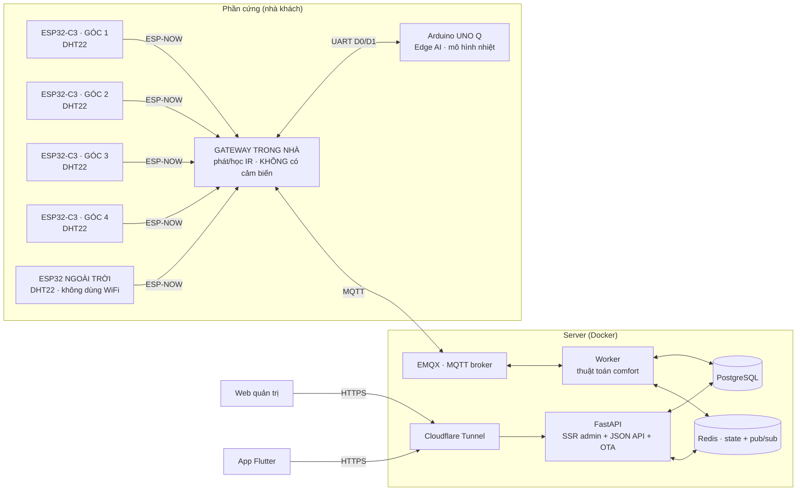

# BreezeLink — Hệ thống điều hoà thích ứng

BreezeLink điều khiển điều hoà **thích ứng theo khí hậu**: cảm biến ESP32 đo nhiệt độ/độ ẩm
ở bốn góc phòng và ngoài trời, một thuật toán comfort tính ra nhiệt độ đặt tiết kiệm điện,
và người dùng điều khiển máy lạnh qua ứng dụng điện thoại. Bên bán quản lý khách hàng,
thiết bị và phát hành bản cập nhật qua một trang web riêng.

Điểm khác biệt so với một bộ điều nhiệt thông thường: **hệ thống chạy tiếp khi mất
internet**. Một máy tính nhỏ đặt trong nhà (Arduino UNO Q) giữ bản sao của thuật toán, học
mô hình nhiệt của chính căn phòng, và tự lái máy lạnh khi máy chủ im lặng quá lâu.

Dự án gồm năm phần chạy chung một backend:

- **Web quản trị** (SSR, cho **bên bán**) — quản lý khách hàng, cấp mã kích hoạt, quản lý
  node, tinh chỉnh thuật toán, phát hành OTA.
- **App Flutter** (cho **khách hàng**) — kích hoạt bằng mã, xem số đo trực tiếp, điều khiển
  điều hoà, tự cập nhật qua OTA.
- **API + Worker** (FastAPI + MQTT) — phục vụ cả web lẫn app từ **một tầng nghiệp vụ duy
  nhất**, nên số liệu trên web và trên app không bao giờ lệch nhau.
- **Firmware ESP32** (6 thiết bị mỗi hộ) — **4 node cảm biến** ở bốn góc phòng
  (ESP32-C3 + DHT22) và **1 node ngoài trời**, tất cả bắn ESP-NOW về **1 gateway** đặt gần
  máy lạnh; gateway phát hồng ngoại và làm cầu nối lên cloud — **nó không đo nhiệt độ**.
- **Edge AI** (Arduino UNO Q) — nối gateway qua **UART**, học mô hình nhiệt của phòng, và
  **tự lái máy lạnh khi mất kết nối cloud**; bình thường chỉ đề xuất.

---

## Mục lục

- [Tính năng](#tính-năng)
- [Kiến trúc](#kiến-trúc)
- [Thuật toán comfort](#thuật-toán-comfort)
- [Edge AI: mô hình nhiệt của phòng](#edge-ai-mô-hình-nhiệt-của-phòng)
- [Công nghệ](#công-nghệ)
- [Cấu trúc dự án](#cấu-trúc-dự-án)
- [Chạy trên máy local](#chạy-trên-máy-local)
- [Biến môi trường](#biến-môi-trường)
- [Triển khai](#triển-khai)
- [Hướng dẫn sử dụng](#hướng-dẫn-sử-dụng)
- [Bảo mật](#bảo-mật)

---

## Tính năng

### Web quản trị (bên bán)

- **Tổng quan** — toàn bộ node đã bán của mọi khách, gom theo khách hàng (xếp A→Z,
  gập/mở), kèm biểu đồ trạng thái trực tuyến/ngoại tuyến.
- **Khách hàng & Máy** — bán sản phẩm (tạo khách + node + mã kích hoạt), quản lý node, cấp
  thêm mã, xem số đo từng node, tìm khách theo SĐT.
- **Cấu hình thuật toán** — tinh chỉnh tham số comfort cho **từng khách**.
- **Phiên bản app** — tải APK lên, phát hành OTA, xem lịch sử, rollback.
- **Cài đặt** — chuyển giao diện Sáng / Tối / Theo hệ thống.
- Cập nhật realtime qua WebSocket. Trang **vá DOM tại chỗ** thay vì vẽ lại, nên danh sách
  không nháy, không tự gập, và không xoá mất chữ đang gõ dở khi có số liệu mới về.

### App khách hàng (Flutter)

- **Kích hoạt bằng mã** — nhập mã được cấp khi mua máy để tạo tài khoản.
- **Bảng điều khiển** — nhiệt độ đặt hiện tại + chuỗi tính toán (có thể kiểm chứng).
- **Điều khiển** — chọn chế độ, ghi đè thủ công, học mã hồng ngoại (IR learn).
- **Nút rời của remote** — tốc độ quạt, ngủ, tiết kiệm, đảo gió… và **hai nút máy tạo
  độ ẩm** (`HUMID_ON`/`HUMID_OFF`). App là nơi **dạy** mọi mã này; panel là nơi dùng
  chúng để tự chạy.
- **Số đo trực tiếp** — trong/ngoài nhà, biểu đồ lịch sử.
- **Tự cập nhật OTA** — báo có bản mới, tải và cài trực tiếp.

### Bảng điều khiển tại chỗ (gateway có màn)

Màn cảm ứng 2.8" trên panel treo tường, **năm trang**, dùng được cả khi mất mạng:
nhiệt/ẩm trong nhà (trung vị các góc) và ngoài trời, điều khiển máy lạnh, **máy tạo
độ ẩm**, trang chẩn đoán 8 dòng (WiFi, MQTT, nhiệt độ **từng góc**, số mã IR, phiên
bản firmware), danh sách mã IR đã học và nhật ký 8 lệnh gần nhất.

Trang góc phòng phân biệt `—` (góc mất kết nối) với `??` (góc còn sống nhưng cảm biến
hỏng) — hai ca dẫn tới hai việc phải làm khác hẳn nhau.

**Đang chạy tự động thì nút chỉnh bị khoá.** `±` và bốn nút chế độ mờ đi cho tới khi
bấm **THỦ CÔNG**. Trước đây chúng vẫn bấm được nhưng không gửi đi đâu, và vòng lặp
comfort kế tiếp kéo con số về — người dùng thấy máy nghe lời mình vài giây rồi tự ý
đổi lại, và đọc ra là bo hỏng.

**Tốc độ quạt và máy tạo độ ẩm chạy bằng mã học từ app.** Cả hai là *nút rời* trong
bảng `ir_action_codes`: app dạy mã một lần, panel giữ một bản trong NVS rồi bắn
thẳng — nên chúng vẫn hoạt động khi mất mạng, khác app vốn phải đi qua máy chủ.

### Trang theo dõi Edge AI (cổng 7000)

Chạy ngay trên UNO Q, không qua internet: nhiệt độ 4 góc, ai đang cầm lái, **hằng số thời
gian của phòng**, công suất lạnh đo được, sai số dự báo so với mốc "phòng đứng yên", biểu
đồ 6 giờ qua và đường dự báo thời tiết 12 giờ tới.

Trang **không tải gì từ bên ngoài** — không CDN, không phông chữ web, biểu đồ vẽ tay bằng
canvas. Một trang theo dõi chỉ hiện được lúc có internet là thứ hỏng đúng vào lúc cần nhất.

---

## Kiến trúc



**Luồng dữ liệu:** bốn node góc phòng và node ngoài trời bắn số đo qua ESP-NOW về gateway;
gateway đứng tên **từng node** đẩy lên MQTT → worker lưu lịch sử (Postgres), lấy **trung
vị** các góc còn tươi làm nhiệt độ trong nhà (Redis) và tính nhiệt độ đặt → phát lệnh IR về
gateway. Cloudflare Tunnel là đường duy nhất từ internet vào — không cổng nào mở ra
`0.0.0.0`.

### Vì sao bốn cảm biến chứ không một

Một cảm biến treo tường không nói được nhiệt độ của phòng, nó nói nhiệt độ của **cái tường
đó**. Góc có nắng chiếu, góc dưới miệng gió và góc sau tủ chênh nhau 3–4 °C là chuyện
thường.

Backend lấy **trung vị**, không phải trung bình cộng — nên một góc bất thường không kéo
được nhiệt độ đặt đi. Trung bình cộng thì có, vĩnh viễn, và triệu chứng duy nhất là "ở
trong nhà thấy sai sai".

### Vì sao cảm biến đi ESP-NOW

Gói ESP-NOW chở được 250 byte nên mỗi node mang thẳng `device_uuid` 32 ký tự của chính nó
— gateway **không giữ bảng tra nào**, thêm hay bớt một góc chỉ cần nạp bo mới.

Gói BLE advertising cổ điển chỉ có 31 byte, chở không nổi uuid, nên sẽ buộc gateway giữ một
mảng uuid và nạp lại mỗi lần đổi node. Lệch một ô là số đo của góc A nộp lên cloud dưới tên
góc B — biểu đồ vẫn có số, không lỗi ở đâu cả.

Node ngoài trời cũng vậy: nó chỉ cần gửi 43 byte mỗi 5 giây, và ESP-NOW bỏ được toàn bộ bắt
tay WiFi/DHCP/TCP nên tốn ít điện hơn hẳn. Nó cũng **không cần tài khoản MQTT riêng** —
gateway đứng tên publish hộ.

### Vì sao gateway ↔ UNO Q là UART chứ không phải Bluetooth

Bản đầu dùng BLE GATT. Đo trên bo thật:

```
Gateway, BLE bật:   0,31 gói ESP-NOW/giây
Gateway, BLE tắt:   0,80 gói/giây      ← đúng bằng 4 node × 5 giây
```

Bật Bluetooth thì ESP32 **bắt buộc** phải bật ngủ WiFi — nó `abort()` chứ không chạy kém
đi. Mà radio ngủ thì gói ESP-NOW đến đúng lúc đó là mất, không ai đệm hộ, và broadcast
không có ACK nên node vẫn báo "đã phát". Node ngoài trời rơi ~50% và nhấp nháy
ONLINE/OFFLINE.

Tức là đường BLE ăn mất **~60% khả năng thu của chính cái gateway nó phục vụ**. UART không
đụng tới radio nên lấy lại toàn bộ. Cái giá là một sợi dây, và hai bo phải nằm cạnh nhau.

Mất luôn cả một mớ lộn xộn kèm theo: không quét, không ghép đôi, không thương lượng MTU,
không NimBLE ~100 KB flash, không ai tranh ăng-ten 2.4 GHz.

> **Đấu dây** (đối chiếu sơ đồ chân chính hãng:
> <https://docs.arduino.cc/hardware/uno-q> — datasheet ABX00162):
> `GPIO18 → D0` (PB7, USART1_RX) · `GPIO17 ← D1` (PB6, USART1_TX) · GND chung.
>
> **Đừng nối vào chân ghi "RX"/"TX"** trên hàng chân kia — đó là `SOC_SE4_RX/TX`, đi thẳng
> vào Qualcomm và chạy **1,8 V**. Hàng chân số không có chữ RX/TX nào, nên đây là chỗ rất
> dễ cắm nhầm, và nhầm là hỏng chân SoC.

### Vì sao UNO Q không nối qua MQTT

Lớp dự phòng phải sống sót đúng cái sự cố nó sinh ra để chịu đựng. Đi qua broker nghĩa là
khi mất mạng — đúng lúc cần nó nhất — nó cũng mất luôn đường tới gateway. UART là dây nối
trực tiếp giữa hai bo đặt cạnh nhau: không router, không internet, không broker.

### Hai radio trên một ăng-ten

Gateway chạy đồng thời WiFi/MQTT và ESP-NOW trên cùng khối 2.4 GHz. Gateway **không quét
WiFi** khi đang chạy (quét là thứ ăn sóng liên tục), và vòng lặp chính **không bao giờ
chặn**: `serviceNetwork()` thử kết nối lại theo nhịp rồi trả về ngay. Bản trước gọi thẳng
`connectWifi()` trong `loop()`, và mất WiFi là chết luôn cả ESP-NOW, UART lẫn hồng ngoại.

---

## Thuật toán comfort

Nhiệt độ đặt được tính theo mô hình **adaptive comfort** (de Dear & Brager, ASHRAE RP-884),
không phải một con số cố định:

1. **Trung bình trượt ngoài trời** (`T_rm`) — làm mượt bằng EMA (`ema_alpha`).
2. **Điểm trung tính** — `T_neutral = 0.31 · T_rm + 17.8` (hợp lệ khi `10 ≤ T_rm ≤ 33.5`).
3. **Bù trừ độ ẩm** — dưới 60%RH không phạt; 60–75% trừ dần theo `humid_slope`; trên 75%
   phạt nặng hơn (bay hơi mồ hôi kém hiệu quả).
4. **Lịch đêm** — cộng `night_offset` trong khung `night_start`→`night_end`.
5. **Giới hạn an toàn** — kẹp trong `[clamp_min, clamp_max]`.
6. **Bám mã IR** — làm tròn về nhiệt độ gần nhất mà hộ đó **đã học mã**.

Tham số ở bước 1, 3, 4, 5 tinh chỉnh được cho **từng khách**. Hằng số hồi quy (0.31 / 17.8)
là khoa học cố định, không chỉnh.

`clamp_min`/`clamp_max` chỉnh được, **nhưng phải nằm trong 16–30 °C** — đó là dải của
chính cái máy lạnh, không phải một sở thích: remote chỉ có ngần ấy mức nên chỉ ngần ấy
mức có mã IR để học, và panel mã hoá đúng dải đó thành 15 bit. Luật nằm ở
`AC_TEMP_MIN`/`AC_TEMP_MAX` (`src/app/comfort/comfort_constants.py`) và được áp ở cả
API `/configs` lẫn form web quản trị.

Chống dao động ba lớp: EMA đầu vào, `deadband` (vùng trễ quanh nhiệt độ đặt), và
`dwell_sec` (thời gian giữ chế độ tối thiểu) bảo vệ block máy nén khỏi bật/tắt liên tục.

> `clamp_max` **trên 28,7 °C là vô tác dụng**: công thức RP-884 kẹp `T_rm` ở 33,5 nên
> `T_neutral` không bao giờ vượt `0.31 × 33.5 + 17.8 = 28,185`; cộng `night_offset` là trần
> thật 28,685.

---

## Edge AI: mô hình nhiệt của phòng

Chạy trên nửa Linux của Arduino UNO Q. **Một mô hình duy nhất, bốn tham số:**

```
T_in[k+1] = a·T_in[k] + b·T_out[k] + c·u[k] + d

u[k] = max(0, T_in[k] − T_set[k])  khi COOL, ngược lại 0
```

Ba con số vật lý rút ra được — thứ mà mô hình hộp đen không cho:

| | Ý nghĩa |
|---|---|
| `τ = −Δt/ln(a)` | hằng số thời gian của phòng |
| `b/(1−a)` | nắng ngoài trời ăn vào phòng bao nhiêu |
| `−c/(1−a)` | công suất lạnh thực tế — **tụt dần nghĩa là máy yếu đi hoặc bẩn lọc** |

### Vì sao đúng bốn tham số

Đây là ràng buộc của **dữ liệu**, không phải sở thích. Nhìn "12.644 điểm đo" rồi kết luận
đủ cho mạng nơ-ron là sai, vì các điểm không độc lập: hai số đo cách nhau một phút trong
một phòng có hằng số thời gian hàng chục phút thì gần như là cùng một số.

Số mẫu **độc lập** ≈ thời lượng ÷ τ. Hai ngày dữ liệu bốn góc ÷ τ≈45 phút ≈ **60 sự kiện
nhiệt độc lập**. Một MLP 32→64→3 có ~2.400 tham số — cần khoảng **hai năm** tích luỹ với
nhịp hiện tại.

### Ba nhịp khác nhau

| Tầng | Nhịp |
|---|---|
| Gateway đẩy ảnh chụp | 5 giây |
| Ghi vào lịch sử | 60 giây (trung bình 12 ảnh chụp) |
| Mô hình cập nhật | 300 giây (lấy mỗi mẫu thứ 5) |

Hai nhịp sau **không tuỳ tiện**. Đo trên dữ liệu giả có đáp án (τ thật 45 phút):

```
Δt = 60s, không trung bình:  τ = 24 phút   (sai 47%)
Δt = 300s, có trung bình:    τ = 47 phút   (sai 5%)
```

Nguyên nhân là **sai lệch suy giảm** (errors-in-variables): nhiễu cảm biến nằm trong chính
biến hồi quy `T_in[k]`, nên nó kéo `a` xuống một cách **có hệ thống**. Hai hệ số kia gần
như không hề hấn gì, nên triệu chứng rất dễ bị bỏ qua. Trung bình 12 mẫu giảm nhiễu
√12 ≈ 3,5 lần; bước 300 giây cho tín hiệu gấp 5 lần so với bước 60 giây.

### Chỉ đề xuất, cho tới khi tự chứng minh

`PredictionScore` chấm mỗi dự báo 15 phút so với **mốc "phòng đứng yên"**, và chỉ báo
`ĐÁNG TIN` khi sai số < 0,3 °C **và** thắng mốc đó ít nhất 20%. Một mô hình chỉ ngang mốc
đó thì mọi phép tính của nó là công cốc, dù sai số tuyệt đối nghe có vẻ nhỏ.

Cho tới lúc đó — và bất cứ khi nào `EDGE_ADVISORY_ONLY=1` — node **chỉ gửi đề xuất**.
Gateway chỉ bắn hồng ngoại khi nhận `kind=COMMAND`; mọi nhánh không đủ điều kiện đều rơi về
`ADVICE` một cách an toàn thay vì phải nhớ chặn.

### Ai được phép ra lệnh

Bất đối xứng có chủ đích: **giành lái** chỉ sau 300 giây máy chủ im lặng, **nhả lái** ngay
khi gateway nghe thấy máy chủ trở lại. Chậm giành thì mất vài phút không thích ứng; chậm
nhả thì hai bên tranh máy nén. Hai cái giá đó không bằng nhau.

Con số im lặng do **gateway đo** — nó giữ phiên MQTT nên biết chắc chắn hơn.

### Lịch sử cục bộ

SQLite đặt cạnh dịch vụ (`python/data/`), ~30 MB/năm ở nhịp một mẫu mỗi phút.
`synchronous=FULL`, không phải `NORMAL`: đo thực tế thì WAL ở mức NORMAL chỉ fsync mỗi
**~5,5 giờ** — tức là mất điện có thể mất trọn cả quá trình học. Ở mức FULL, mất điện chỉ
mất tối đa mẫu đang ghi dở.

Khởi động lại thì mô hình **nạp lại toàn bộ lịch sử**: đủ 120 cặp thì khớp mẻ một phát,
chưa đủ thì phát lại từng mẫu qua RLS. Nên thời gian tích luỹ **cộng dồn** qua các lần mất
điện thay vì đặt lại về 0.

---

## Công nghệ

| Lớp | Công nghệ |
|---|---|
| Backend | Python 3.12, FastAPI, SQLAlchemy 2 (async), Alembic |
| CSDL / cache | PostgreSQL 15, Redis 7 |
| IoT | MQTT (EMQX 5), paho-mqtt |
| App | Flutter (Dart), Dio, package_info_plus, url_launcher |
| Firmware | C++ (Arduino-ESP32), PlatformIO, LVGL 8 + TFT_eSPI, IRremoteESP8266, ESP-NOW |
| Edge AI | Python 3.13, numpy, SQLite, Arduino App Lab (`web_ui`, RouterBridge) |
| Phần cứng | ESP32-S3 (gateway/panel) · **5× ESP32-C3** (4 góc phòng + ngoài trời) · Arduino UNO Q · DHT22 · LED IR |
| Hạ tầng | Docker Compose, Cloudflare Tunnel |
| Web admin | SSR Jinja2 + design system "Titanium Command" (CSS thuần, không CDN) |

---

## Cấu trúc dự án

```
AirConditioner/
├── src/app/               # Backend FastAPI
│   ├── api/               #   JSON API (/api/v1) + OTA công khai (/app)
│   ├── web/               #   SSR admin (/web): routes, templates, static
│   ├── services/          #   Tầng nghiệp vụ (dùng chung web + app)
│   ├── comfort/           #   Thuật toán setpoint + running-mean
│   ├── workers/           #   Worker MQTT (comfort loop, IR)
│   ├── models/            #   ORM (SQLAlchemy)
│   └── alembic/           #   Migration CSDL
├── app-flutter/           # App khách hàng (Flutter)
├── FirmWare/              # Firmware ESP32 (PlatformIO)
│   ├── esp32-s3-panel/    #   PANEL TREO TƯỜNG CHÍNH THỨC (bo 2.8" ESP32-S3)
│   │   ├── src/           #     MÃ NGUỒN PANEL — bản DUY NHẤT, cả 3 env dùng chung
│   │   │   ├── ui/        #       Giao diện LVGL (chạy trên lõi 0)
│   │   │   ├── ir-*        #       Phát/học IR + kho mã trong NVS
│   │   │   ├── unoq-link.* #       Đường UART tới Arduino UNO Q
│   │   │   ├── board-pins.h #      Sơ đồ chân THEO BO, chọn bằng cờ -D BOARD_*
│   │   │   └── room-registry.*  #  Bảng 4 góc + trung vị
│   │   └── tools/         #     Sinh font VLW / ảnh LVGL, đọc serial
│   ├── esp32-room/        #   4 NODE GÓC PHÒNG (env ss1..ss4, mỗi node một UUID)
│   ├── esp32-outdoor/     #   Node NGOÀI TRỜI (ESP32-C3, slave ESP-NOW)
│   ├── shared/            #   Khuôn gói ESP-NOW + radio slave + giao thức UART với UNO Q
│   └── Interface/         #   Thiết kế giao diện + sơ đồ chân
├── edge-ai/               # Dịch vụ Edge AI cho Arduino UNO Q
│   ├── edge_ai/           #   thermal_model, history_store, weather, dashboard,
│   │                      #   prediction_score, cloud_watch, controller, bridge_client
│   ├── applab/BreezeLink/ #   App của Arduino App Lab (sketch + python + assets)
│   └── deploy/            #   Bộ dựng payload + unit systemd
├── Icon/                  # Ảnh gốc sinh ra MỌI icon của dự án
├── docker/                # Dockerfile + compose (local + vps)
├── scripts/               # deploy.sh, push-unoq-app.sh, seed_demo.py
└── docs/                  # Tài liệu thiết kế
```

---

## Chạy trên máy local

**Yêu cầu:** Docker + Docker Compose. (Chạy app cần thêm Flutter SDK.)

### 1. Backend + web quản trị

```bash
cp .env.example .env
#   sửa JWT_SECRET và MQTT_PASS thành giá trị của bạn
#   (app từ chối chạy nếu JWT_SECRET còn giá trị mặc định)

docker compose -f docker/docker-compose.yml up -d --build

# dữ liệu demo — scripts/ không nằm trong image nên đưa qua stdin.
# DEMO_PASSWORD là bắt buộc: script cố ý không có mật khẩu mặc định, vì một
# cặp đăng nhập role=owner ghi cứng trong mã nguồn thì ai đọc repo cũng dùng được.
# Token MQTT của hai thiết bị demo được sinh ngẫu nhiên và in ra một lần.
docker compose -f docker/docker-compose.yml exec -T \
  -e DEMO_PASSWORD='dat-mat-khau-cua-ban' \
  api python - < scripts/seed_demo.py
```

- Web quản trị: **http://localhost:8201/web/login**
- API docs: **http://localhost:8201/docs**
- Migration `alembic upgrade head` **tự chạy** khi container API khởi động.

### 2. App Flutter

```bash
cd app-flutter
flutter pub get
flutter run
# Địa chỉ máy chủ nạp LÚC BIÊN DỊCH — không ghi cứng trong mã (repo công khai).
# Quên cờ này thì APK vẫn dựng được nhưng ô "Địa chỉ máy chủ" ở màn đăng nhập
# để trống, và app nói thẳng ra điều đó thay vì đổ lỗi cho mạng.
flutter build apk --release \n    --dart-define=BREEZELINK_BASE_URL=https://quan-tri.cua-ban.com
#   -> build/app/outputs/flutter-apk/app-release.apk
```

**Đổi icon toàn dự án:** thay `Icon/1.png` rồi

```bash
python scripts/generate-icons.py            # sinh 25 file: favicon web, iOS, PWA, trang :7000
python scripts/generate-icons.py --check    # chỉ liệt kê, không ghi đè
cd app-flutter && dart run flutter_launcher_icons   # riêng Android có lớp adaptive
```

Script tự dò ô vuông cắt bằng hàm khoảng cách và **giữ đúng kích thước cũ của từng file** —
mỗi nền tảng có luật riêng, đổi kích thước một file là làm hỏng đúng nền tảng ấy theo cách
chỉ lộ ra lúc đóng gói.

### 3. Firmware ESP32

`config.h` **không có trong repo** (bị ignore vì chứa mật khẩu WiFi + token MQTT). Lấy giá
trị ở web quản trị → *Khách hàng* → mở node → **"Nạp firmware"**.

```bash
# GATEWAY / PANEL treo tường
cd FirmWare/esp32-s3-panel && pio run -e esp32s3-panel -t upload

# 4 NODE GÓC PHÒNG — nodes.ini khai từng bo, nạp lần lượt
cd FirmWare/esp32-room
cp nodes.ini.example nodes.ini    # điền DEVICE_UUID của từng góc
pio run -e ss1 -t upload && pio run -e ss2 -t upload   # ...ss3, ss4

# NODE NGOÀI TRỜI
cd FirmWare/esp32-outdoor && pio run -e esp32-espnow -t upload
```

Sáu điều dễ mất thời gian nhất nếu không biết trước:

- **Mỗi node góc phòng phải có `DEVICE_UUID` riêng.** `ROOM_CORNER` chỉ là **nhãn hiển
  thị**, hai bo trùng số góc là vô hại.
- **`WIFI_SSID` phải giống hệt nhau ở CẢ SÁU thiết bị** và phải là băng 2.4 GHz. Node cảm
  biến không đăng nhập WiFi — chúng chỉ *quét* đúng chuỗi tên này để biết router đang ở
  kênh nào, vì ESP-NOW bắt buộc mọi bên cùng kênh. Lệch một ký tự là gói bay vào khoảng
  không, và vì broadcast **không có ACK** nên không một dòng log nào báo lỗi.
- **Công suất phát của node C3 để 8 dBm, không phải 19,5 dBm.** Mức cao trên bo cấp nguồn
  qua USB phát ra sóng méo không giải mã được — gateway nhận 0 gói, đúng như khi hỏng dây.
- **Bo QR Box phải có nguồn riêng 9–24 VDC ở P2/P4.** Cắm mỗi USB-TTL vào P3 đủ để nạp
  nhưng không nuôi nổi màn lúc chạy. Phân biệt bằng mã reset: `POWERON_RESET` là nguồn,
  `SW_CPU_RESET` mới là phần mềm.
- **Mã IR sống trong NVS**, không mất khi nạp lại firmware — nhưng `erase_flash` thì mất sạch.
- **Đừng chạy `pio pkg install`**: nó ghi đè `platformio.ini` và xoá hết chú thích.

```bash
pio device monitor -p COMx -b 115200    # có RESET bo -> xem được log khởi động

# KHÔNG reset -> giữ nguyên trạng thái đã tích luỹ, dùng khi đang truy lỗi
python FirmWare/esp32-s3-panel/tools/read_serial.py COMx 30
```

### 4. Edge AI trên Arduino UNO Q

Chạy như một App của **Arduino App Lab**:

```bash
python edge-ai/deploy/build-applab-app.py      # gom edge_ai + lát cắt comfort
bash scripts/push-unoq-app.sh edge-ai/applab/BreezeLink
```

Rồi bấm **Run** trong App Lab. Trang theo dõi ở `http://<ip-bo>:7000`.

Cấu hình nằm ở `edge-ai/applab/BreezeLink/python/.env` (**không** vào git):

| Biến | Ý nghĩa |
|---|---|
| `EDGE_ORG_ID` | Băm thành `link_key` mà gateway kiểm. Sai một ký tự là mọi lệnh bị từ chối **lặng lẽ**. |
| `EDGE_IR_TEMPS` | Các mức COOL hộ đã học mã. Để trống thì edge tự học bằng quan sát — và danh sách lấp một nửa **nguy hiểm hơn** danh sách rỗng. |
| `EDGE_COMFORT_CONFIG` | Cấu hình comfort thật của hộ. Để trống thì edge tính bằng mặc định và **lặng lẽ lệch** với máy chủ. |
| `EDGE_LAT` / `EDGE_LON` | Toạ độ lấy dự báo thời tiết. |
| `EDGE_ADVISORY_ONLY` | `1` = chỉ đề xuất, không bao giờ bắn IR. |

---

## Biến môi trường

Khai báo trong `.env` (xem `.env.example`). Quan trọng nhất:

| Biến | Ý nghĩa |
|---|---|
| `JWT_SECRET` | **Bắt buộc đổi.** App từ chối khởi động nếu còn `change-me-in-production`. |
| `DB_URL` | Chuỗi kết nối PostgreSQL (async). |
| `REDIS_URL` | Kết nối Redis. |
| `MQTT_HOST` / `MQTT_PORT` / `MQTT_PASS` | Kết nối MQTT broker. |
| `SMTP_*` | Gửi email (đặt lại mật khẩu, thông báo). |
| `CF_TUNNEL_TOKEN` | Token Cloudflare Tunnel — chỉ trong `docker/.env` trên server, **không** commit. |
| `MQTT_PUBLIC_HOST` | IP/tên máy chủ MQTT mà **firmware** nối tới. Cũng ở `docker/.env`; compose **từ chối khởi động** nếu thiếu, thay vì chạy với giá trị rỗng. |

---

## Triển khai

`scripts/deploy.sh` đồng bộ **chỉ thư mục `src/`**, rebuild container và kiểm tra sức khoẻ
— **không bao giờ đụng `docker/.env`** (token tunnel).

Địa chỉ máy chủ **không nằm trong mã** — chép bản mẫu rồi điền:

```bash
cp scripts/deploy.env.example scripts/deploy.env   # AC_HOST / AC_USER / AC_URL
```

```bash
scripts/deploy.sh              # hỏi xác nhận
scripts/deploy.sh --yes        # không hỏi
AC_HOST=1.2.3.4 scripts/deploy.sh   # biến môi trường vẫn thắng file trên
```

Thiếu cấu hình thì script **dừng ngay** và nói thiếu biến nào, thay vì chạy tới
bước `ssh` rồi treo ở một tên máy rỗng — lỗi lúc đó đọc ra là "mạng hỏng".

Mỗi lần deploy gián đoạn ~30–40 giây (cloudflared khởi động lại). Script chờ tới 60 giây
cho tunnel gắn lại trước khi kết luận — hỏi một lần ngay sau đó gần như chắc chắn gặp 502
và báo thất bại cho một lần deploy đã thành công.

> **Sửa `app.css` hoặc `app.js` thì không phải nhớ gì thêm.** Chuỗi phá đệm `?v=` được băm
> từ chính nội dung file, nên nó tự đổi. Trước đây là một hằng số gõ tay, và nó từng khiến
> một bản vá deploy xong mà trình duyệt vẫn chạy bản cũ thêm 4 tiếng.

### Đổi tên miền

**Thiết bị không ảnh hưởng** — ESP32 nối MQTT bằng **IP trần**, không qua tên miền.

> ⚠️ **App đã cài trên máy khách mới là chỗ nguy hiểm.** App lưu base URL vào
> `SharedPreferences`, và **giá trị đã lưu luôn thắng giá trị mặc định**. Phát hành bản mới
> với `_kDefaultBaseUrl` mới **không cứu được khách cũ** — bản mới phải kèm một đoạn **di
> trú một lần**. Và nếu tắt domain cũ trước khi khách kịp cập nhật thì họ mất luôn đường
> nhận bản sửa, vì `/app/update.json` cũng nằm ở đúng domain vừa chết.

Cách làm an toàn — mấu chốt là **một Cloudflare Tunnel gắn được nhiều hostname**:

1. Thêm hostname mới vào **đúng tunnel đang chạy** → hai tên cùng sống
2. Đổi `RESET_PASSWORD_URL_BASE` + `SMTP_FROM` trong `docker/.env`, restart api
3. Phát hành app mới (default mới + đoạn di trú) — **qua domain cũ, lúc nó còn sống**
4. Theo dõi cột **phiên bản app** trong web quản trị để biết khách nào đã lên bản mới
5. Chỉ khi không còn ai dùng bản cũ mới gỡ hostname cũ

Chưa bán cho ai thì bỏ hết năm bước, đổi thẳng.

---

## Hướng dẫn sử dụng

### Bên bán (web)

1. **Đăng nhập** `/web/login`.
2. **Bán sản phẩm** — *Khách hàng & Máy* → "Tạo sản phẩm + sinh mã", nhập số node.
3. **Đưa mã cho khách** — khách nhập mã trong app; tên, SĐT, email **tự hiện** trên web.
4. **Quản lý** — sửa/thêm/xoá node, cấp thêm mã, chỉnh cấu hình thuật toán, xem số đo.
5. **Phát hành app** — *Phiên bản app* → tải APK với version code tăng dần.

### Khách hàng (app)

1. Cài app → "Mới mua máy? Kích hoạt bằng mã".
2. Nhập **mã kích hoạt** + email + mật khẩu → tạo tài khoản.
3. Dùng bảng điều khiển để xem nhiệt độ đặt, số đo trực tiếp và điều khiển máy lạnh.
4. Khi có bản cập nhật, app tự hiện hộp thoại tải bản mới.

---

## Bảo mật

- Bí mật thật (**token tunnel, JWT secret, mật khẩu DB, MQTT**) nằm trong `.env` /
  `docker/.env` — **được `.gitignore` loại khỏi repo**.
- **`FirmWare/*/src/config.h` và `esp32-room/nodes.ini` bị ignore** — mỗi node có mật khẩu
  WiFi của khách và một cặp `DEVICE_UUID`/`MQTT_PASSWORD` riêng.
- **`edge-ai/applab/BreezeLink/python/.env` bị ignore** — chứa `EDGE_ORG_ID` của hộ.
- APK, keystore ký app, khoá riêng đều bị ignore.
- Trang quản trị **chỉ dành cho nhân viên** (`is_sysadmin`); khách hàng dùng app.
- Xoá khách hàng yêu cầu gõ đúng tên để xác nhận (cascade, không hoàn tác).
- `link_key` giữa UNO Q và gateway **không phải xác thực** — nó chặn được một UNO Q của hộ
  khác vô tình nối nhầm, không chặn được kẻ cố ý. Mối đe doạ ở đây (ai đó cầm được dây UART
  trong nhà bạn) không tương xứng với chi phí siết chặt.

> Nếu bạn tự triển khai bản riêng, hãy tạo `docker/.env` **trực tiếp trên server** với
> `CF_TUNNEL_TOKEN`, `JWT_SECRET`, `POSTGRES_PASSWORD`… của riêng bạn — không commit.

---

## Giấy phép

[MIT](LICENSE) — dùng, sửa, phát hành lại, kể cả cho mục đích thương mại; chỉ cần giữ
dòng bản quyền.

**Không bao gồm trong repo** (giữ local, không phát hành lại vì thuộc bên thứ ba):

| Tài liệu | Lấy ở đâu |
|---|---|
| ASHRAE 55 — adaptive comfort | <https://www.ashrae.org> (tiêu chuẩn có bản quyền, phải mua) |
| Arduino UNO Q — datasheet, sơ đồ chân, schematic | <https://docs.arduino.cc/hardware/uno-q> |
| Schematic màn cảm ứng | nhà cung cấp bo |

Thuật toán comfort trong `src/app/comfort/` là bản cài đặt **từ mô hình đã công bố**
(de Dear & Brager, ASHRAE RP-884) — hằng số hồi quy `0.31` / `17.8` là khoa học công
khai, không phải nội dung sao chép từ bản tiêu chuẩn.

