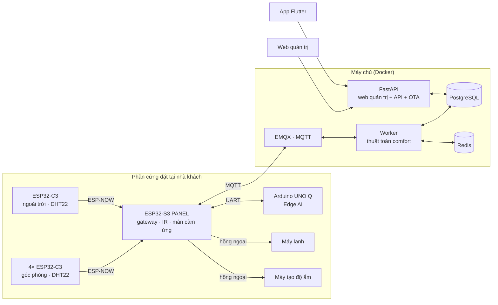

# BreezeLink — Báo cáo kỹ thuật

Tài liệu tổng hợp cho thuyết trình: hệ thống làm gì, chạy trên công nghệ nào,
thuật toán và mô hình học máy bên trong ra sao, và dùng nó thế nào.

Mọi con số trong tài liệu này lấy trực tiếp từ mã nguồn, có ghi rõ file — để lúc
bị hỏi vặn thì mở đúng chỗ ra chỉ được.

---

## Mục lục

- [1. Hệ thống làm gì](#1-hệ-thống-làm-gì)
- [2. Kiến trúc](#2-kiến-trúc)
- [3. Thuật toán comfort — trái tim của hệ](#3-thuật-toán-comfort--trái-tim-của-hệ)
- [4. Mô hình AI ở lớp Edge](#4-mô-hình-ai-ở-lớp-edge)
- [5. Điều khiển máy tạo độ ẩm](#5-điều-khiển-máy-tạo-độ-ẩm)
- [6. Công nghệ sử dụng](#6-công-nghệ-sử-dụng)
- [7. Hướng dẫn sử dụng](#7-hướng-dẫn-sử-dụng)
- [8. Sáu quyết định kỹ thuật đáng bảo vệ](#8-sáu-quyết-định-kỹ-thuật-đáng-bảo-vệ)

---

## 1. Hệ thống làm gì

BreezeLink điều khiển điều hoà **thích ứng theo khí hậu**. Thay vì giữ một nhiệt
độ cố định do người dùng đặt, nó **tính ra nhiệt độ dễ chịu** theo thời tiết
ngoài trời — trời càng nóng, cơ thể càng quen với mức cao hơn, nên đặt máy lạnh
thấp là vừa tốn điện vừa khó chịu.

Ba điểm khác một bộ điều nhiệt thông thường:

| | Thông thường | BreezeLink |
|---|---|---|
| Nhiệt độ đặt | người dùng chọn một con số | tính từ mô hình adaptive comfort |
| Đo nhiệt độ phòng | một cảm biến treo tường | **trung vị 4 góc phòng** |
| Mất internet | ngừng thích ứng | **máy tính tại chỗ tự lái** |

### Thiết bị của một hộ

| Số lượng | Thiết bị | Vai trò |
|---|---|---|
| 4 | ESP32-C3 + DHT22 | cảm biến 4 góc phòng |
| 1 | ESP32-C3 + DHT22 | cảm biến ngoài trời |
| 1 | ESP32-S3 + màn 2.8" | **gateway/panel** — phát hồng ngoại, cầu nối cloud, màn điều khiển tại chỗ |
| 1 | Arduino UNO Q | **Edge AI** — học mô hình nhiệt của phòng |

---

## 2. Kiến trúc



**Luồng dữ liệu:** 5 node cảm biến bắn ESP-NOW về panel → panel đứng tên **từng
node** đẩy lên MQTT → worker lưu lịch sử, lấy **trung vị** các góc còn tươi, tính
nhiệt độ đặt → phát lệnh hồng ngoại ngược về panel.

### Vì sao bốn cảm biến chứ không một

Một cảm biến treo tường không nói được nhiệt độ của phòng — nó nói nhiệt độ của
**cái tường đó**. Góc có nắng chiếu, góc dưới miệng gió và góc sau tủ chênh nhau
3–4 °C là chuyện thường.

Backend lấy **trung vị**, không phải trung bình cộng. Một góc bất thường (nắng
chiếu thẳng vào cảm biến) không kéo được nhiệt độ đặt đi. Trung bình cộng thì có
— vĩnh viễn — và triệu chứng duy nhất là "ở trong nhà thấy sai sai".

---

## 3. Thuật toán comfort — trái tim của hệ

Dựa trên mô hình **adaptive comfort** của de Dear & Brager (ASHRAE RP-884), nền
tảng của tiêu chuẩn ASHRAE 55. Cài đặt ở `src/app/comfort/setpoint_calculator.py`.

### Ý tưởng khoa học

Con người **thích nghi** với khí hậu nơi mình sống. Người ở Sài Gòn tháng 4 thấy
28 °C là dễ chịu; cũng người đó vào tháng 12 sẽ thấy 28 °C là nóng. Mô hình
adaptive comfort nắm bắt điều đó bằng một đường hồi quy tuyến tính từ **nhiệt độ
ngoài trời trung bình trượt** ra **nhiệt độ trung tính**.

### Sáu bước tính

```
1. T_rm       = EMA(nhiệt độ ngoài trời)              ← làm mượt, hệ số ema_alpha
2. T_neutral  = 0.31 × T_rm + 17.8                    ← hồi quy RP-884
3. T_target   = T_neutral − phạt_độ_ẩm(RH)
4. T_target  += night_offset  (trong khung giờ đêm)
5. T_set      = kẹp(T_target, clamp_min, clamp_max)
6. T_set      = làm tròn về mức ĐÃ HỌC MÃ IR gần nhất
```

**Hằng số `0.31` và `17.8`** (`ADAPTIVE_SLOPE`, `ADAPTIVE_INTERCEPT`) là kết quả
hồi quy trên bộ dữ liệu RP-884 — **khoa học cố định, không chỉnh**. Công thức chỉ
hợp lệ khi `10 ≤ T_rm ≤ 33.5`, nên `T_rm` bị kẹp vào dải đó.

**Bù trừ độ ẩm** — ba đoạn, `HUMID_LOW_KNEE = 60`, `HUMID_HIGH_KNEE = 75`:

| Độ ẩm | Xử lý |
|---|---|
| < 60 %RH | không phạt — mồ hôi bay hơi tốt |
| 60–75 %RH | trừ dần theo `humid_slope` |
| > 75 %RH | phạt dốc hơn (`HUMID_HIGH_SLOPE = 0.06`) — bay hơi kém hẳn |

### Chống dao động ba lớp

Đây là phần quyết định hệ **dùng được** hay chỉ chạy được trên giấy:

| Lớp | Cơ chế | Chặn cái gì |
|---|---|---|
| **EMA** | làm mượt đầu vào | nhiễu cảm biến từng mẫu |
| **Deadband** | vùng trễ quanh `T_set` | dao động quanh điểm cắt |
| **Dwell** | thời gian giữ chế độ tối thiểu | bật/tắt block máy nén liên tục |

Bỏ lớp nào cũng "vẫn chạy" lúc thử, và chỉ hỏng khi nhiệt độ đi ngang đúng mép
ngưỡng — tức là ở đúng điều kiện thường gặp nhất.

> **Một giới hạn thật, nên nói ra trước khi bị hỏi:** `clamp_max` đặt trên
> 28,7 °C là vô tác dụng với vòng tự động. Công thức kẹp `T_rm` ở 33,5 nên
> `T_neutral` không bao giờ vượt `0.31 × 33.5 + 17.8 = 28,185`; cộng
> `night_offset` là trần thật 28,685.

---

## 4. Mô hình AI ở lớp Edge

Chạy trên nửa Linux của **Arduino UNO Q**, đặt cạnh panel, nối bằng UART.
Mã ở `edge-ai/edge_ai/thermal_model.py`.

### Mô hình: một phương trình, bốn tham số

```
T_in[k+1] = a·T_in[k] + b·T_out[k] + c·u[k] + d

u[k] = max(0, T_in[k] − T_set[k])   khi máy đang COOL, ngược lại 0
```

Đây là **mô hình nhiệt bậc một** của căn phòng — dạng rời rạc hoá của phương
trình cân bằng nhiệt. Ước lượng bằng **RLS (Recursive Least Squares)** với hệ số
quên `FORGET = 0.995`, bước `DT_SEC = 300`, cần `MIN_SAMPLES = 120` cặp mới coi
là sẵn sàng.

### Ba con số vật lý rút ra được

Đây là lý do chọn mô hình có cấu trúc thay vì mạng nơ-ron hộp đen:

| Đại lượng | Ý nghĩa vật lý |
|---|---|
| `τ = −Δt / ln(a)` | **hằng số thời gian của phòng** — cách nhiệt tốt hay kém |
| `b / (1−a)` | nắng ngoài trời ăn vào phòng bao nhiêu |
| `−c / (1−a)` | **công suất lạnh thực tế** — tụt dần nghĩa là máy yếu đi hoặc bẩn lọc |

Con số thứ ba là một tính năng chẩn đoán bảo trì mà mô hình hộp đen không cho
được: nó **đo sức khoẻ của máy lạnh** theo thời gian.

### Vì sao đúng bốn tham số, không phải mạng nơ-ron

Đây là câu hỏi chắc chắn bị hỏi, và câu trả lời là **ràng buộc của dữ liệu**, chứ
không phải sở thích kỹ thuật.

Nhìn "12.644 điểm đo" rồi kết luận đủ cho mạng nơ-ron là sai, vì **các điểm không
độc lập**: hai số đo cách nhau một phút trong một phòng có hằng số thời gian hàng
chục phút thì gần như là cùng một số.

```
Số mẫu ĐỘC LẬP ≈ thời lượng ÷ τ

Hai ngày dữ liệu ÷ τ≈45 phút ≈ 60 sự kiện nhiệt độc lập
Một MLP 32→64→3 có ~2.400 tham số
→ cần khoảng HAI NĂM tích luỹ với nhịp hiện tại
```

Bốn tham số ước lượng được từ 60 sự kiện. 2.400 thì không.

### Ba nhịp khác nhau — và vì sao không tuỳ tiện

| Tầng | Nhịp |
|---|---|
| Panel đẩy ảnh chụp sang UNO Q | 5 giây |
| Ghi vào lịch sử | 60 giây (trung bình 12 ảnh chụp) |
| Mô hình cập nhật | 300 giây (lấy mỗi mẫu thứ 5) |

Đo trên dữ liệu giả có đáp án (τ thật 45 phút):

```
Δt = 60s,  không trung bình:  τ = 24 phút   (sai 47%)
Δt = 300s, có trung bình:     τ = 47 phút   (sai  5%)
```

Nguyên nhân là **sai lệch suy giảm** (*errors-in-variables*): nhiễu cảm biến nằm
trong chính biến hồi quy `T_in[k]`, nên nó kéo `a` xuống **một cách có hệ thống**.
Hai hệ số kia gần như không hề hấn gì, nên triệu chứng rất dễ bị bỏ qua. Trung
bình 12 mẫu giảm nhiễu √12 ≈ 3,5 lần; bước 300 giây cho tín hiệu gấp 5 lần.

### Mô hình phải tự chứng minh trước khi được cầm lái

`edge_ai/prediction_score.py` chấm mỗi dự báo 15 phút so với **mốc "phòng đứng
yên"** (naive: dự báo nhiệt độ sẽ không đổi), cửa sổ `WINDOW = 96` mẫu:

```python
trustworthy = mae < 0.3 and mae < naive_mae * 0.8
```

Hai điều kiện, và điều kiện thứ hai mới là điều kiện thật: mô hình phải **thắng
mốc ngây thơ ít nhất 20 %**. Một mô hình chỉ ngang mốc đó thì mọi phép tính của
nó là công cốc, dù sai số tuyệt đối nghe có vẻ nhỏ.

Cho tới khi đạt cả hai, node **chỉ gửi đề xuất**. Panel chỉ bắn hồng ngoại khi
nhận `kind=COMMAND`; mọi nhánh không đủ điều kiện đều rơi về `ADVICE` một cách an
toàn thay vì phải nhớ chặn.

### Ai được phép ra lệnh

Bất đối xứng có chủ đích:

- **Giành lái**: chỉ sau **300 giây** máy chủ im lặng
- **Nhả lái**: **ngay** khi panel nghe thấy máy chủ trở lại

Chậm giành thì mất vài phút không thích ứng; chậm nhả thì hai bên tranh máy nén.
Hai cái giá đó không bằng nhau.

---

## 5. Điều khiển máy tạo độ ẩm

Chạy **ngay trên panel**, không qua máy chủ — `FirmWare/esp32-s3-panel/src/humidifier-control.h`.
Vòng điều khiển khép kín trong nhà nên nó hoạt động cả khi mất internet.

### Hai ngưỡng, và khoảng trống giữa chúng

| Độ ẩm (đã làm mượt) | Hành động |
|---|---|
| **< 45 %** | BẬT |
| 45 – 60 % | giữ nguyên — **vùng trễ** |
| **> 60 %** | TẮT |

Ngưỡng tắt 60 % **neo vào `HUMID_LOW_KNEE`** của thuật toán comfort: máy tạo ẩm
không bao giờ được đẩy phòng vượt qua mốc mà chính thuật toán comfort bắt đầu coi
là khó chịu. Nếu không, hai bộ điều khiển trong một căn nhà đang đánh nhau.

### Sáu nhánh ưu tiên, trên đè dưới

```
1. Chạy liên tục > 4 giờ  → CẮT + khoá 30 phút, đè cả ghi đè tay
2. Ghi đè tay             → giữ ý người dùng (tự hết hạn sau 2 giờ)
3. Mất số đo > 2 phút     → CẮT
4. Đang khoá đổ nước      → giữ TẮT
5. Vùng trễ               → muốn bật hay tắt
6. Dwell                  → CHỈ chặn chiều TẮT
```

Nhánh 1 nằm **trên** nhánh 2 có lý do: "bấm tay rồi quên" chính là ca mà giới hạn
giờ chạy sinh ra để chặn. Và khoá 30 phút là bắt buộc — cắt xong mà không khoá
thì vòng kế tiếp vẫn thấy phòng khô và bật lại ngay.

Nguyên tắc xuyên suốt: **nghi ngờ thì TẮT**. Máy tắt oan thì phòng khô thêm vài
phút; máy bật oan mà không ai biết thì nó chạy tới cạn bình.

### Dwell bất đối xứng

Dwell 300 giây **chỉ chặn chiều tắt**. Lý do gốc của dwell — *"hơi nước cần vài
phút mới lan tới cảm biến"* — là chuyện xảy ra **sau khi đã bật**: nó ngăn ta vội
kết luận lệnh vừa rồi không có tác dụng. Nó không nói gì về việc có nên bật hay
không khi phòng đang khô thật.

```
BẬT MUỘN → phòng cứ khô, người ở cảm nhận được ngay
TẮT MUỘN → máy phun thêm vài phút, gần như vô hại
```

Không sợ dao động: đã bật rồi thì phải vượt 60 %RH mới tắt. **Deadband 15 điểm
mới là lớp chặn dao động, không phải dwell.**

### Thời gian đáp ứng

| Lớp | Trễ |
|---|---|
| Node gửi số đo | 0–5 s |
| Nhịp quyết định | 0–5 s |
| Lọc EMA (α = 0.5) | τ ≈ 7 s |

**Tổng ~5–10 giây** từ lúc phòng thật sự xuống dưới 45 %RH.

---

## 6. Công nghệ sử dụng

| Lớp | Công nghệ | Vì sao chọn |
|---|---|---|
| Backend | Python 3.12, FastAPI, SQLAlchemy 2 async, Alembic | async hợp với I/O-bound (MQTT + HTTP + DB) |
| CSDL | PostgreSQL 15 | lịch sử telemetry, quan hệ khách–thiết bị |
| Cache/state | Redis 7 | trạng thái tức thời + pub/sub realtime |
| IoT | MQTT (EMQX 5), paho-mqtt | chuẩn de-facto, QoS1 cho lệnh không được rơi |
| App | Flutter (Dart) | một mã nguồn cho Android/iOS |
| Firmware | C++ Arduino-ESP32, PlatformIO, LVGL 8, IRremoteESP8266, ESP-NOW | |
| Edge AI | Python 3.13, NumPy, SQLite | NumPy đủ cho RLS 4 tham số; SQLite không cần dịch vụ |
| Hạ tầng | Docker Compose, Cloudflare Tunnel | tunnel = không mở cổng nào ra `0.0.0.0` |
| Web quản trị | SSR Jinja2, CSS thuần | không CDN — trang phải chạy được khi mạng kém |

### Vì sao cảm biến đi ESP-NOW chứ không WiFi

| | ESP-NOW | WiFi/MQTT trực tiếp |
|---|---|---|
| Bắt tay | không có | WiFi + DHCP + TCP + MQTT |
| Điện năng | thấp | cao |
| Tài khoản MQTT | không cần | mỗi node một tài khoản |

Gói ESP-NOW chở được 250 byte nên mỗi node mang thẳng `device_uuid` 32 ký tự của
chính nó — panel **không giữ bảng tra nào**, thêm hay bớt một góc chỉ cần nạp bo
mới.

Gói BLE advertising cổ điển chỉ có 31 byte, chở không nổi uuid, nên sẽ buộc panel
giữ một mảng uuid và nạp lại mỗi lần đổi node. **Lệch một ô là số đo của góc A
nộp lên cloud dưới tên góc B** — biểu đồ vẫn có số, không lỗi ở đâu cả.

### Vì sao panel ↔ UNO Q là UART chứ không Bluetooth

Bản đầu dùng BLE GATT. Đo trên bo thật:

```
Panel, BLE bật:   0,31 gói ESP-NOW/giây
Panel, BLE tắt:   0,80 gói/giây      ← đúng bằng 4 node × 5 giây
```

Bật Bluetooth thì ESP32 **bắt buộc** phải bật ngủ WiFi — nó `abort()` chứ không
chạy kém đi. Radio ngủ thì gói ESP-NOW đến đúng lúc đó là mất, mà broadcast không
có ACK nên node vẫn báo "đã phát".

Tức là đường BLE ăn mất **~60 % khả năng thu của chính cái panel nó phục vụ**.
UART không đụng tới radio nên lấy lại toàn bộ. Cái giá là một sợi dây.

---

## 7. Hướng dẫn sử dụng

### 7.1 Bên bán — web quản trị

1. **Đăng nhập** `/web/login`
2. **Bán sản phẩm** — *Khách hàng & Máy* → "Tạo sản phẩm + sinh mã", nhập số node
3. **Đưa mã cho khách** — khách nhập mã trong app; tên, SĐT, email tự hiện trên web
4. **Quản lý** — sửa/thêm/xoá node, cấp thêm mã, chỉnh cấu hình thuật toán
5. **Phát hành app** — *Phiên bản app* → tải APK với version code tăng dần

> Cấu hình thuật toán chỉnh được **cho từng khách**: `ema_alpha`, `deadband`,
> `dwell_sec`, `humid_slope`, `clamp_min/max` (bắt buộc trong **16–30 °C** — dải
> thật của máy lạnh), `night_start/end/offset`, `override_hours`.

### 7.2 Khách hàng — app điện thoại

1. Cài app → "Mới mua máy? Kích hoạt bằng mã"
2. Nhập **mã kích hoạt** + email + mật khẩu
3. **Tab Trạng thái** — nhiệt độ đặt hiện tại kèm **chuỗi tính toán kiểm chứng được**
4. **Tab Điều khiển** — vòng chỉnh nhiệt độ, chế độ, tốc độ quạt, các nút rời
5. **Tab Học remote** — dạy từng mã hồng ngoại, gồm cả **máy tạo độ ẩm**
6. Có bản mới thì app tự hiện hộp thoại cập nhật

> **Học mã là bước bắt buộc** trước khi tự động chạy được: hệ không thể điều khiển
> máy lạnh nếu chưa biết khung hồng ngoại của nó.

### 7.3 Panel treo tường — dùng được khi mất mạng

Năm trang:

| Trang | Nội dung |
|---|---|
| **Trang chủ** | nhiệt/ẩm trong nhà (trung vị) + ngoài trời, chế độ, huy hiệu TỰ ĐỘNG/THỦ CÔNG |
| **Điều khiển** | ±, 4 chế độ, THỦ CÔNG/TỰ ĐỘNG, tốc độ quạt |
| **Máy tạo ẩm** | trạng thái, độ ẩm, **lý do**, tình trạng mã IR, BẬT/TẮT/TỰ ĐỘNG |
| **Thông tin** | 8 dòng chẩn đoán: WiFi, MQTT, nhiệt độ **từng góc**, số mã IR, firmware |
| **Cài đặt** | độ sáng, khởi động lại, danh sách mã IR, nhật ký 8 lệnh gần nhất |

**Đang chạy tự động thì nút chỉnh bị khoá** — `±` và bốn nút chế độ mờ đi cho tới
khi bấm THỦ CÔNG. Trước đây chúng bấm được nhưng không gửi đi đâu, và vòng lặp
comfort kế tiếp kéo con số về; người dùng đọc ra là bo hỏng.

Trang góc phòng phân biệt `—` (góc mất kết nối) với `??` (góc còn sống nhưng cảm
biến hỏng) — hai ca dẫn tới hai việc phải làm khác hẳn nhau.

---

## 8. Sáu quyết định kỹ thuật đáng bảo vệ

Phần này dành cho hỏi–đáp: mỗi mục là một lựa chọn có thể bị chất vấn, kèm lý do
và bằng chứng.

**1. Trung vị, không phải trung bình cộng.** Một góc nắng chiếu không được phép
kéo cả hệ. Trung bình cộng thì kéo được, vĩnh viễn, và không có triệu chứng nào
ngoài "thấy sai sai".

**2. Mô hình 4 tham số, không phải mạng nơ-ron.** Ràng buộc của dữ liệu, không
phải của kỹ thuật: số mẫu **độc lập** ≈ thời lượng ÷ τ. Và mô hình có cấu trúc
cho ra ba đại lượng vật lý, trong đó `−c/(1−a)` **đo được sức khoẻ máy lạnh**.

**3. Mô hình phải thắng mốc ngây thơ 20 % mới được cầm lái.** Sai số tuyệt đối
nhỏ chưa đủ — trong một phòng ổn định, dự báo "không đổi gì" cũng có sai số nhỏ.

**4. Lớp dự phòng nối UART, không qua MQTT.** Lớp dự phòng phải sống sót đúng cái
sự cố nó sinh ra để chịu đựng. Đi qua broker nghĩa là khi mất mạng — đúng lúc cần
nó nhất — nó cũng mất luôn đường tới panel.

**5. Ba lớp chống dao động, và dwell bất đối xứng.** Mỗi lớp chặn một loại dao
động khác nhau. Dwell của máy tạo ẩm chỉ chặn chiều tắt vì lý do gốc của nó chỉ
đúng cho chiều đó.

**6. Không bao giờ hiện `0` khi thiếu số đo.** NAN hiện thành `—`, không phải
`0.0`. Một hệ khẳng định sai còn nguy hiểm hơn một hệ im lặng — người dùng tin
vào con số 0 và đi tìm lỗi ở chỗ không có lỗi.

---

## Phụ lục — mở đúng file khi bị hỏi

| Chủ đề | File |
|---|---|
| Thuật toán comfort | `src/app/comfort/setpoint_calculator.py` |
| Quyết định chế độ + dwell | `src/app/comfort/mode_decision.py` |
| Mô hình nhiệt (RLS) | `edge-ai/edge_ai/thermal_model.py` |
| Chấm điểm dự báo | `edge-ai/edge_ai/prediction_score.py` |
| Điều khiển máy tạo ẩm | `FirmWare/esp32-s3-panel/src/humidifier-control.h` |
| Khuôn gói ESP-NOW | `FirmWare/shared/espnow-message.h` |
| Giao thức UART tới UNO Q | `FirmWare/shared/unoq-link-protocol.h` |
| Giao diện panel | `FirmWare/Interface/README.md` |
