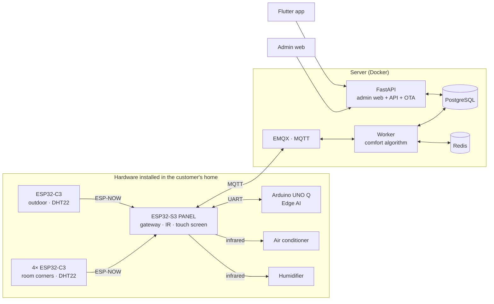

# BreezeLink — Technical report

A consolidated document for presentations: what the system does, what technology it runs
on, what the algorithm and machine-learning model inside it look like, and how to use it.

Every number in this document comes straight from the source, with the file named — so
that when someone pushes back, the right place can be opened and pointed at.

---

## Table of contents

- [1. What the system does](#1-what-the-system-does)
- [2. Architecture](#2-architecture)
- [3. The comfort algorithm — the heart of the system](#3-the-comfort-algorithm--the-heart-of-the-system)
- [4. The AI model at the edge layer](#4-the-ai-model-at-the-edge-layer)
- [5. Humidifier control](#5-humidifier-control)
- [6. Technology used](#6-technology-used)
- [7. User guide](#7-user-guide)
- [8. Six technical decisions worth defending](#8-six-technical-decisions-worth-defending)

---

## 1. What the system does

BreezeLink controls air conditioning **adaptively to the climate**. Instead of holding a
fixed temperature chosen by the user, it **computes a comfortable temperature** from the
outdoor weather — the hotter it is outside, the more the body acclimatises to higher
values, so setting the AC low is both wasteful and uncomfortable.

Three differences from an ordinary thermostat:

| | Ordinary | BreezeLink |
|---|---|---|
| Setpoint | the user picks a number | computed from an adaptive comfort model |
| Measuring room temperature | one wall-mounted sensor | **median of 4 room corners** |
| Loss of internet | adaptation stops | **the local computer takes over** |

### Devices in one household

| Count | Device | Role |
|---|---|---|
| 4 | ESP32-C3 + DHT22 | sensors in the 4 room corners |
| 1 | ESP32-C3 + DHT22 | outdoor sensor |
| 1 | ESP32-S3 + 2.8" display | **gateway/panel** — infrared transmitter, cloud bridge, local control screen |
| 1 | Arduino UNO Q | **Edge AI** — learns the room's thermal model |

---

## 2. Architecture



**Data flow:** 5 sensor nodes broadcast over ESP-NOW to the panel → the panel pushes each
node's data up to MQTT **on that node's behalf** → the worker stores the history, takes the
**median** of the fresh corners, computes the setpoint → sends the infrared command back
down to the panel.

### Why four sensors and not one

A single wall-mounted sensor does not tell you the temperature of the room — it tells you
the temperature of **that wall**. A corner in direct sun, a corner under the air outlet and
a corner behind a cabinet routinely differ by 3–4 °C.

The backend takes the **median**, not the mean. One anomalous corner (sun falling directly
on the sensor) cannot drag the setpoint away. A mean can — permanently — and the only
symptom is "it just feels wrong in here".

---

## 3. The comfort algorithm — the heart of the system

Based on the **adaptive comfort** model of de Dear & Brager (ASHRAE RP-884), the foundation
of the ASHRAE 55 standard. Implemented in `src/app/comfort/setpoint_calculator.py`.

### The scientific idea

People **acclimatise** to the climate they live in. Someone in Ho Chi Minh City in April
finds 28 °C pleasant; the same person in December finds 28 °C hot. The adaptive comfort
model captures this with a linear regression from the **running-mean outdoor temperature**
to the **neutral temperature**.

### The six computation steps

```
1. T_rm       = EMA(outdoor temperature)              ← smoothing, coefficient ema_alpha
2. T_neutral  = 0.31 × T_rm + 17.8                    ← RP-884 regression
3. T_target   = T_neutral − humidity_penalty(RH)
4. T_target  += night_offset  (during the night window)
5. T_set      = clamp(T_target, clamp_min, clamp_max)
6. T_set      = round to the nearest temperature WITH A LEARNED IR CODE
```

**The constants `0.31` and `17.8`** (`ADAPTIVE_SLOPE`, `ADAPTIVE_INTERCEPT`) are the result
of a regression over the RP-884 dataset — **fixed science, not tunable**. The formula is
only valid for `10 ≤ T_rm ≤ 33.5`, so `T_rm` is clamped to that range.

**Humidity compensation** — three segments, `HUMID_LOW_KNEE = 60`, `HUMID_HIGH_KNEE = 75`:

| Humidity | Treatment |
|---|---|
| < 60 %RH | no penalty — sweat evaporates well |
| 60–75 %RH | subtract progressively, per `humid_slope` |
| > 75 %RH | steeper penalty (`HUMID_HIGH_SLOPE = 0.06`) — evaporation is markedly worse |

### Three layers of oscillation control

This is what decides whether the system is **usable** or merely works on paper:

| Layer | Mechanism | What it blocks |
|---|---|---|
| **EMA** | smooths the input | per-sample sensor noise |
| **Deadband** | hysteresis around `T_set` | oscillation around the switching point |
| **Dwell** | minimum time in a mode | continuous compressor cycling |

Drop any one of them and it "still works" in testing, only failing when the temperature
sits right at the threshold — which is to say, under the most common condition of all.

> **A real limitation, better stated before someone asks:** setting `clamp_max` above
> 28.7 °C has no effect on the automatic loop. The formula clamps `T_rm` at 33.5, so
> `T_neutral` never exceeds `0.31 × 33.5 + 17.8 = 28.185`; adding `night_offset` puts the
> real ceiling at 28.685.

---

## 4. The AI model at the edge layer

Runs on the Linux half of the **Arduino UNO Q**, mounted next to the panel and connected by
UART. The code is in `edge-ai/edge_ai/thermal_model.py`.

### The model: one equation, four parameters

```
T_in[k+1] = a·T_in[k] + b·T_out[k] + c·u[k] + d

u[k] = max(0, T_in[k] − T_set[k])   when the unit is in COOL, otherwise 0
```

This is the room's **first-order thermal model** — a discretised form of the heat balance
equation. Estimated with **RLS (Recursive Least Squares)** with a forgetting factor of
`FORGET = 0.995`, a step of `DT_SEC = 300`, and `MIN_SAMPLES = 120` pairs required before it
counts as ready.

### Three physical quantities you can extract

This is the reason for choosing a structured model over a black-box neural network:

| Quantity | Physical meaning |
|---|---|
| `τ = −Δt / ln(a)` | **the room's time constant** — how well or badly it is insulated |
| `b / (1−a)` | how much outdoor sun makes it into the room |
| `−c / (1−a)` | **actual cooling power** — a steady decline means the unit is weakening or the filter is dirty |

That third number is a maintenance-diagnostic feature a black-box model cannot give you: it
**measures the air conditioner's health** over time.

### Why exactly four parameters, and not a neural network

This question is guaranteed to be asked, and the answer is **a constraint of the data**, not
a technical preference.

Looking at "12,644 data points" and concluding that is enough for a neural network is wrong,
because **the points are not independent**: two readings a minute apart in a room whose time
constant is tens of minutes are essentially the same number.

```
Number of INDEPENDENT samples ≈ duration ÷ τ

Two days of data ÷ τ≈45 minutes ≈ 60 independent thermal events
An MLP of 32→64→3 has ~2,400 parameters
→ roughly TWO YEARS of accumulation at the current rate
```

Four parameters can be estimated from 60 events. 2,400 cannot.

### Three different cadences — and why they are not arbitrary

| Layer | Cadence |
|---|---|
| Panel pushes a snapshot to the UNO Q | 5 seconds |
| Written to history | 60 seconds (averaging 12 snapshots) |
| Model update | 300 seconds (taking every 5th sample) |

Measured on synthetic data with a known answer (true τ of 45 minutes):

```
Δt = 60s,  no averaging:   τ = 24 minutes   (47% error)
Δt = 300s, with averaging: τ = 47 minutes   ( 5% error)
```

The cause is **attenuation bias** (*errors-in-variables*): sensor noise sits inside the
regressor `T_in[k]` itself, so it pulls `a` down **systematically**. The other two
coefficients are almost untouched, which makes the symptom very easy to overlook. Averaging
12 samples cuts the noise by √12 ≈ 3.5×; a 300-second step gives 5× the signal.

### The model has to prove itself before it is allowed to drive

`edge_ai/prediction_score.py` scores every 15-minute forecast against a **"the room stands
still" baseline** (naive: predict the temperature will not change), over a `WINDOW = 96`
sample window:

```python
trustworthy = mae < 0.3 and mae < naive_mae * 0.8
```

Two conditions, and the second is the real one: the model must **beat the naive baseline by
at least 20 %**. A model that merely matches that baseline makes all of its computation
pointless, however small the absolute error sounds.

Until both are met, the node **sends advice only**. The panel only fires infrared when it
receives `kind=COMMAND`; every branch that does not qualify falls back safely to `ADVICE`
instead of relying on someone remembering to block it.

### Who is allowed to issue commands

Deliberately asymmetric:

- **Taking control**: only after **300 seconds** of server silence
- **Releasing control**: **immediately** when the panel hears the server return

Taking over late costs a few minutes without adaptation; releasing late means both sides
fight over the compressor. Those two costs are not equal.

---

## 5. Humidifier control

Runs **entirely on the panel**, not through the server —
`Firmware/esp32-s3-panel/src/humidifier-control.h`. The control loop is closed inside the
house, so it keeps working with no internet.

### Two thresholds, and the gap between them

| Humidity (smoothed) | Action |
|---|---|
| **< 45 %** | ON |
| 45 – 60 % | unchanged — **hysteresis band** |
| **> 60 %** | OFF |

The 60 % off-threshold is **anchored to the comfort algorithm's `HUMID_LOW_KNEE`**: the
humidifier must never push the room past the point where the comfort algorithm itself starts
treating it as uncomfortable. Otherwise you have two controllers in one house fighting each
other.

### Six priority branches, upper overrides lower

```
1. Running continuously > 4 hours → CUT + 30-minute lockout, overrides even a manual override
2. Manual override                → respect the user's intent (auto-expires after 2 hours)
3. No reading for > 2 minutes     → CUT
4. Refill lockout active          → stay OFF
5. Hysteresis band                → whether it wants to be on or off
6. Dwell                          → blocks the OFF direction ONLY
```

Branch 1 sits **above** branch 2 for a reason: "pressed the button and forgot" is exactly the
case the runtime limit exists to catch. And the 30-minute lockout is mandatory — cut without
locking out and the next cycle still sees a dry room and switches straight back on.

The principle throughout: **when in doubt, turn it OFF**. A wrongly stopped unit leaves the
room dry for a few more minutes; a wrongly running unit that nobody notices runs until the
tank is empty.

### Asymmetric dwell

The 300-second dwell **only blocks the off direction**. The original reason for the dwell —
*"water vapour needs a few minutes to reach the sensor"* — is something that happens **after
switching on**: it stops us concluding too early that the last command had no effect. It says
nothing about whether to switch on when the room really is dry.

```
LATE ON  → the room stays dry, the occupant notices immediately
LATE OFF → the unit sprays for a few more minutes, almost harmless
```

No risk of oscillation: once on, it has to exceed 60 %RH to switch off. **The 15-point
deadband is the oscillation guard, not the dwell.**

### Response time

| Layer | Delay |
|---|---|
| Node sends a reading | 0–5 s |
| Decision cadence | 0–5 s |
| EMA filter (α = 0.5) | τ ≈ 7 s |

**Total ~5–10 seconds** from the moment the room actually drops below 45 %RH.

---

## 6. Technology used

| Layer | Technology | Why it was chosen |
|---|---|---|
| Backend | Python 3.12, FastAPI, SQLAlchemy 2 async, Alembic | async suits I/O-bound work (MQTT + HTTP + DB) |
| Database | PostgreSQL 15 | telemetry history, customer–device relationships |
| Cache/state | Redis 7 | instantaneous state + realtime pub/sub |
| IoT | MQTT (EMQX 5), paho-mqtt | the de-facto standard, QoS1 for commands that must not be dropped |
| App | Flutter (Dart) | one codebase for Android/iOS |
| Firmware | C++ Arduino-ESP32, PlatformIO, LVGL 8, IRremoteESP8266, ESP-NOW | |
| Edge AI | Python 3.13, NumPy, SQLite | NumPy is enough for a 4-parameter RLS; SQLite needs no service |
| Infrastructure | Docker Compose, Cloudflare Tunnel | the tunnel means no port is opened to `0.0.0.0` |
| Admin web | SSR Jinja2, plain CSS | no CDN — the page has to work on a poor connection |

### Why the sensors use ESP-NOW rather than WiFi

| | ESP-NOW | Direct WiFi/MQTT |
|---|---|---|
| Handshake | none | WiFi + DHCP + TCP + MQTT |
| Power | low | high |
| MQTT accounts | not needed | one account per node |

An ESP-NOW frame carries 250 bytes, so each node carries its own 32-character `device_uuid`
directly — the panel **keeps no lookup table**, and adding or removing a corner only means
flashing a new board.

A classic BLE advertising packet is only 31 bytes, not enough for the uuid, so it would force
the panel to keep a uuid array and be reflashed every time a node changes. **One slot out of
place and corner A's readings land in the cloud under corner B's name** — the charts still
show numbers and nothing anywhere reports an error.

### Why the panel ↔ UNO Q link is UART and not Bluetooth

The first version used BLE GATT. Measured on real hardware:

```
Panel, BLE on:    0.31 ESP-NOW packets/second
Panel, BLE off:   0.80 packets/second      ← exactly 4 nodes × 5 seconds
```

Turning on Bluetooth **forces** the ESP32 to enable WiFi sleep — it `abort()`s rather than
merely degrading. With the radio asleep, an ESP-NOW frame arriving at that moment is lost, and
since broadcast has no ACK the node still reports "sent".

In other words, the BLE link ate **~60 % of the receive capacity of the very panel it was
serving**. UART does not touch the radio, so all of it comes back. The price is one wire.

---

## 7. User guide

### 7.1 The vendor — admin web

1. **Log in** at `/web/login`
2. **Sell a product** — *Khách hàng & Máy* → "Tạo sản phẩm + sinh mã", enter the node count
3. **Give the code to the customer** — they enter it in the app; name, phone and email appear
   on the web UI automatically
4. **Manage** — edit/add/remove nodes, issue more codes, adjust the algorithm configuration
5. **Release the app** — *Phiên bản app* → upload an APK with an increasing version code

> The algorithm configuration is tunable **per customer**: `ema_alpha`, `deadband`,
> `dwell_sec`, `humid_slope`, `clamp_min/max` (must be within **16–30 °C** — the air
> conditioner's real range), `night_start/end/offset`, `override_hours`.

### 7.2 The customer — phone app

1. Install the app → "Mới mua máy? Kích hoạt bằng mã"
2. Enter the **activation code** + email + password
3. **Status tab** — the current setpoint together with a **verifiable computation chain**
4. **Control tab** — the temperature dial, mode, fan speed, discrete buttons
5. **Learn-remote tab** — teach each infrared code, including the **humidifier**
6. When a new version exists, the app shows an update dialog automatically

> **Learning the codes is a mandatory step** before automation can work: the system cannot
> drive an air conditioner whose infrared frames it does not know.

### 7.3 The wall panel — usable with no network

Five pages:

| Page | Contents |
|---|---|
| **Trang chủ** | indoor temperature/humidity (median) + outdoor, mode, AUTO/MANUAL badge |
| **Điều khiển** | ±, 4 modes, MANUAL/AUTO, fan speed |
| **Máy tạo ẩm** | state, humidity, **reason**, IR code status, ON/OFF/AUTO |
| **Thông tin** | 8 diagnostic lines: WiFi, MQTT, **per-corner** temperature, IR code count, firmware |
| **Cài đặt** | brightness, restart, IR code list, log of the last 8 commands |

**While running in automatic mode the adjustment buttons are locked** — `±` and the four mode
buttons are dimmed until MANUAL is pressed. They used to be pressable but sent nowhere, and
the next comfort cycle pulled the number back; users read that as a broken board.

The room-corner page distinguishes `—` (corner offline) from `??` (corner alive but sensor
faulty) — two cases that call for entirely different actions.

---

## 8. Six technical decisions worth defending

This section is for Q&A: each item is a choice that may be challenged, with the reasoning and
the evidence.

**1. Median, not mean.** One sunlit corner must not be allowed to drag the whole system. A
mean can, permanently, with no symptom beyond "it feels wrong".

**2. A 4-parameter model, not a neural network.** A constraint of the data, not of the
engineering: the number of **independent** samples ≈ duration ÷ τ. And a structured model
yields three physical quantities, one of which — `−c/(1−a)` — **measures the air
conditioner's health**.

**3. The model must beat the naive baseline by 20 % before it may drive.** A small absolute
error is not enough — in a stable room, predicting "nothing changes" also has a small error.

**4. The fallback layer is wired over UART, not routed through MQTT.** A fallback layer has to
survive exactly the failure it was built for. Going through a broker means that when the
network drops — exactly when it is needed most — it also loses its path to the panel.

**5. Three layers of oscillation control, and an asymmetric dwell.** Each layer blocks a
different kind of oscillation. The humidifier's dwell only blocks the off direction, because
its original justification only holds for that direction.

**6. Never display `0` when a reading is missing.** NaN renders as `—`, not `0.0`. A system
that asserts something false is more dangerous than one that stays silent — the user believes
the zero and goes looking for a fault where there is none.

---

## Appendix — which file to open when questioned

| Topic | File |
|---|---|
| Comfort algorithm | `src/app/comfort/setpoint_calculator.py` |
| Mode decision + dwell | `src/app/comfort/mode_decision.py` |
| Thermal model (RLS) | `edge-ai/edge_ai/thermal_model.py` |
| Forecast scoring | `edge-ai/edge_ai/prediction_score.py` |
| Humidifier control | `Firmware/esp32-s3-panel/src/humidifier-control.h` |
| ESP-NOW packet layout | `Firmware/shared/espnow-message.h` |
| UART protocol to the UNO Q | `Firmware/shared/unoq-link-protocol.h` |
| Panel UI | `Firmware/Interface/README.md` |
